### [1] What is Android Software Stack. What are the major components of the Android platform?

Applications run on top of a software stack that is based on a Linux kernel, native C/C++ libraries, and a runtime that
executes the application code.

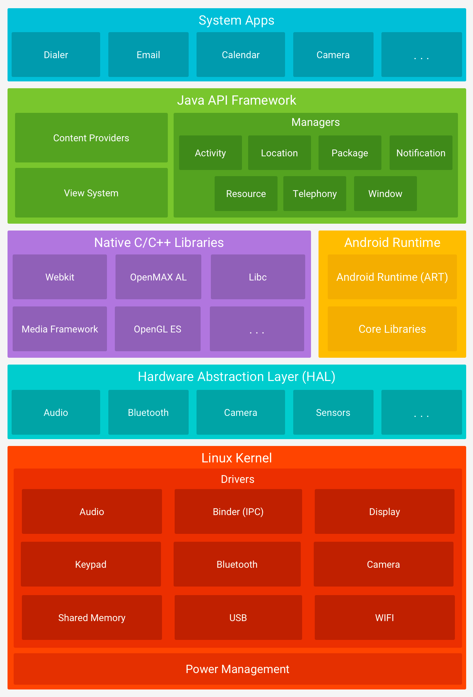

From the top:

1. **System Apps**  - Android applications that are implemented in Java. They utilize both Java and Android framework
   libraries. Android comes with a set of core apps for email, SMS messaging, calendars, internet browsing, contacts,
   and more. If your app would like to deliver an SMS message, you don't need to build that functionality yourself—you
   can instead invoke whichever SMS app is already installed to deliver a message to the recipient you specify.

2. **Java API framework** - **The entire feature-set of the Android OS** is available to you **through APIs** written in
   the Java language.  
   It contains Android classes that handle the window system, UI toolkit, resources, and so on—basically everything that
   is required to write an Android application in Java. The framework **defines and manages the lifecycles** of the
   Android components and their intercommunication. It defines a set of Android-specific asynchronous mechanisms that
   applications can utilize to simplify the thread management: HandlerThread, AsyncTask, IntentService,
   AsyncQueryHandler, and etc.

3. **Native C/C++ Libraries** - Many core Android system components and services, such as ART and HAL, are built from
   native code that require native libraries written in C and C++. Java applications normally don’t interact directly
   with the native libraries because the Application framework provides Java wrappers for the native code. If you are
   developing an app that requires C or C++ code, you can use the _Android NDK_ to access some of these native platform
   libraries directly from your native code.

   The Native Development Kit (NDK) - is a set of tools that allows you to use C and C++ code with Android. Allows you
   to build **performance-critical** parts of your app. hen you build your project, this code is compiled into a native
   library that Gradle can package with your app.

4. **Android Runtime** - Each app runs in its own process ([App sandbox question](#3-what-is-app-sandbox)) and with its
   own instance of the Android Runtime. Android Runtime is written to run multiple virtual machines on low-memory
   devices by executing DEX files. DEX files - a bytecode format designed specially for Android that's optimized for
   minimal memory footprint. Build tools, such as d8, compile Java sources into DEX bytecode, which can run on the
   Android platform.

   Before Android version 5.0 (API level 21) it was Dalvik, but now its
   ART ([JVM vs Dalvik vs ART](#2-why-android-os-uses-dvm-instead-of-jvm-why-android-depreciated-dvm-and-started-to-use-art))
   .

5. **HAL (Hardware Abstraction Layer)** - provides standard interfaces that expose device hardware capabilities to the
   higher-level Java API Framework. The HAL consists of multiple library modules, each of which implements an interface
   for a specific type of hardware components, such as the camera or Bluetooth module, for example.
   **When a framework API makes a call** to access device hardware, the Android system **loads** the library module for
   that hardware component.

6. **Linux kernel** - The foundation of the Android platform. Android relies on the Linux kernel for underlying
   functionalities such as **threading** and **low-level memory management**. Linux kernel launch/fork a new process for
   every application, and every process
   **holds a runtime** with a running application. Also, within the process, multiple threads can execute the
   application code. The kernel splits the available CPU execution time for processes and their threads through _
   scheduling_.

### [2] Why Android OS uses DVM instead of JVM? Why Android depreciated DVM and started to use ART?

**Java Virtual Machine vs Dalvik Virtual Machine:**

- JVM is stack based but DVM is register based which is designed to run on low memory.
- JVM uses java byte code and runs ‘.class’ file having JIT (Just in Time) where DVM uses its own byte code and runs
  ‘.dex’ file.
- In JVM, single instance is of JVM is shared with multiple applications where DVM has been designed so that the device
  can run multiple instance of VM efficiently. Applications are given their own instance.
- JVM support multiple operating system where DVM supports Android operating system only.
- In JVM, the executable is JAR where in DVM the executable is APK.

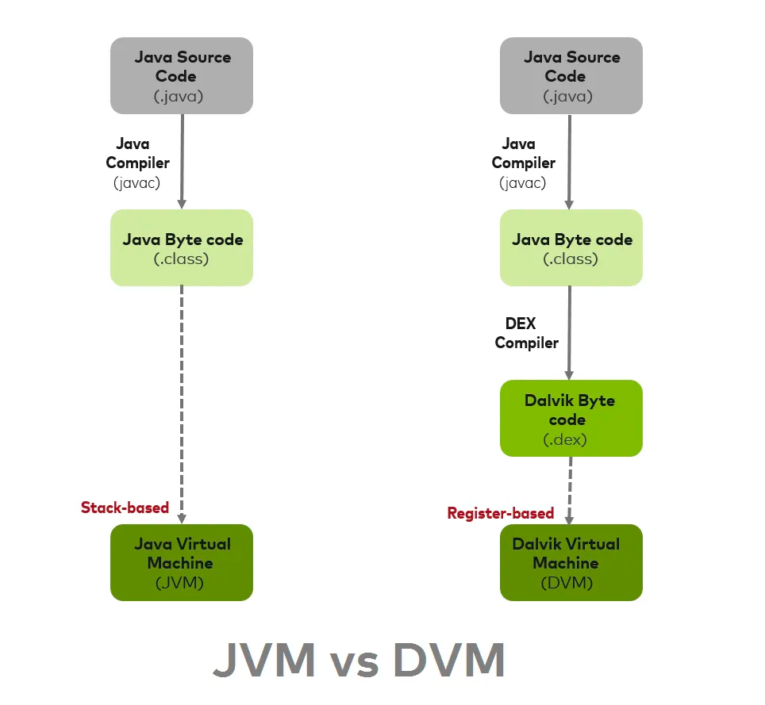

_Main reasons of using DVM in android is DVM takes less memory, runs and loads faster compared to JVM._

**ART vs DVM**

- **DVM uses JIT (Just in Time) compilation**

  App is compiled every time when an app is launched.
- **ART uses AOT (Ahead-of-Time) compilation.**

  App complies only once. During the app’s installation phase, AOT ( Ahead-of-Time)
  statically translates the DEX bytecode into machine code and stores in the device’s storage. This is a one-time event
  and happens only when the app is installed on the device. This leads to better battery life and great performance. So
  there’s no need for JIT compilation, and the code executes much faster.
- **Garbage collector.**

  One of the main reasons for a poor UX, poor responsiveness, and ultimately bad reviews. In the Dalvik days, GC used to
  have two passes over the heap, which led to poor UXs. This situation is improved in ART, as only one pass over the
  heap to consolidate the memory is
  required. [Android GC work](#8-how-does-a-garbage-collector-work-which-garbage-collector-used-in-android)

- ART _reduce startup time of applications_ and _improved battery performance_.

  Drawbacks: _increase app installation time_ and (as the native machine code generated on installation is stored in
  internal storage) _more internal storage is required_.

To tackle these Drawbacks such as initial installation time and memory from Android Nougat JIT (Just In Time )
Compilation was reintroduced with code profiling along with AOT, and an interpreter in the ART thus making it hybrid.
Using the Hybrid Runtime, there won’t be any compilation during install, and applications can be started right away, the
bytecode is interpreted. Now with ART and the new JIT the application installation is faster. The new JIT constantly
does profiling and improves applications as they run.

[Link1](https://medium.com/programming-lite/android-core-jvm-dvm-art-jit-aot-855039a9a8fa)

[Link2](https://source.android.com/docs/core/runtime/configure)

[Video](https://www.youtube.com/watch?v=0J1bm585UCc)

### [3] What is App Sandbox?

Applications execute in different processes and Virtual Machines. Each Android app lives in its own security sandbox. By
default, every app runs in its own Linux process. Each process has its own virtual machine (VM).

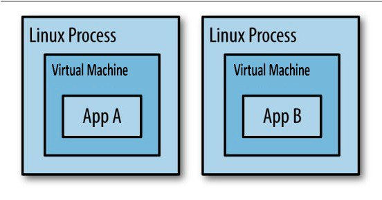

Each process has its own virtual machine (VM), so an app's code runs in isolation from other apps. By default, every app
runs in its own Linux process. The Android system starts the process when any of the app's components need to be
executed, and then shuts down the process when it's no longer needed or when the system must recover memory for other
apps.

By default, the system assigns each app a unique Linux user ID (the ID is used only by the system and is unknown to the
app). The system sets permissions for all the files in an app so that only the user ID assigned to that app can access
them. The Android system implements the principle of least privilege. That is, each app, by default, has access only to
the components that it requires to do its work and no more. This creates a very secure environment in which an app
cannot access parts of the system for which it is not given permission.

To share data with other apps look [Inter Process Communication](#5-inter-process-communication-ipc)

It's possible to arrange for two apps to share the same Linux user ID (AndroidManifest - sharedUserID), in which case
they are able to access each other's files. To conserve system resources, apps with the same user ID can also arrange to
run in the same Linux process and share the same VM. The apps must also be signed with the same certificate.

### [4] Android build process

[//]: # (TODO https://medium.com/androiddevnotes/the-internals-of-android-apk-build-process-article-5b68c385fb20)

### [5] Inter process communication (IPC)

### [6] How the application launch process works

An application is launched when one of its components (Activity, Service, BroadcastReceiver, ContentProvider) is
initiated to execute. Any component can be an entry point for an application, and as soon as the first component starts,
the Linux process (if not already running) is started, which results in the following startup sequence:

1. Linux process starts
2. Android Runtime is created
3. An instance of the Application class is created
4. The application entry point component is created

Setting up a new Linux process and runtime is not an instant operation. This may reduce performance and have a
noticeable impact on the user experience. So the system tries reduce the startup time of Android applications by
launching a special process called Zygote at system boot.

What does Zygote do? To answer this question, you need to understand how processes work.

At the very early stage of loading the Linux OS (at the time of loading the kernel) the very first process is created -
_swapper_ or _sched_ (a process with Process ID = 0). Each process can create new processes (child process), through the
fork function. Fork involves the creation of a new process that is an exact copy of the parent process.
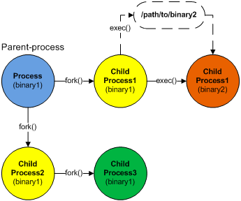

Efficient and fast application launch is achieved by the fact that Zygote starts with a preload all classes and
resources that the application may potentially need at runtime into system memory. When the application starts, it forks
from the Zygote process. It is the parent for all Android applications.

Zygote comes pre-installed with the entire set of core libraries. New application processes are forked from the Zygote
process without copying core libraries that are common to all applications.

Fork involves the creation of a new process that is an exact copy of the parent process. It doesn't actually copy
anything, instead it maps the resources of the new process to those of the parent process and makes copies only when the
new process changes something.

[Read more: Linux process lifecycle](https://www.okbsapr.ru/library/publications/kanner_2015_3/)

### [7] What is process ranking?

Android system uses Low Memory Killer Daemon (LMK) ([Link](https://source.android.com/docs/core/perf/lmkd)).

Low Memory Killer Daemon - process monitors the memory state of a running Android system and reacts to high memory
pressure by killing the least essential processes to keep the system performing at acceptable levels.

Main reason for introduction of LMK in android was OOM (Out of Memory) killer sometimes kill high priority process
(Like foreground applications) in low memory conditions, on the other hand LMK has interface (oom score value)
with activity manager (framework part) which knows priority of processes this results LMK always kill hidden and empty
applications before killing foreground and active applications.

Process ranking:

1. **Foreground process**

   Application has a visible component in front, Service is bound to an Activity in front in a remote process or
   BroadcastReceiver is running.
2. **Visible Process**

   Application has a visible component but is partly obscured.
3. **Service Process**

   Service is executing in the background and is not tied to a visible component.
4. **Background process**

   A nonvisible Activity. This is the process level that contains most applications.
5. **Empty Process**

   A process without active components. Empty processes are kept around to improve startup times, but they are the first
   to be terminated when the system reclaims resources.

The system can have multiple application processes running even while the user perceives them as terminated. The empty
processes are lingering (if system resources permit it) to shorten the startup time on restarts.

### [8] How does a garbage collector work? Which garbage collector used in Android?

### [9] Does increasing threads increase performance?

**Introduction:**

On the operating system level, the thread has both an instruction and a stack pointer. The instruction pointer
references the next instruction to be processed, and the stack pointer references a private memory area —_not available
to other threads_— where thread-local data is stored.

A CPU can process instructions from _one thread at a time_, but a system normally has multiple threads that require
processing at the same time. For the user to perceive that applications can run in parallel, the CPU has to share its
processing time between the application threads. The sharing of a CPU’s processing time is handled by a _scheduler_.
That determines what thread the CPU should process and for how long. The scheduling strategy can be implemented in
various ways, but it is mainly based on the thread priority(from 1 to 10): a high-priority thread gets the CPU
allocation before a low-priority thread, which gives more execution time to high-priority threads.

A thread change is known as _context switch_. A context switch starts by storing the state of the executing thread so
that the execution can be resumed at a later point, whereafter that thread has to wait. The scheduler then restores
another waiting thread for processing.

**Answer:**

Our job will take longer to finish if we generate thousands of threads since we’ll have to spend time switching between
their contexts. Too many threads might have two negative effects. First, when a fixed quantity of work is divided among
too many threads, each thread receives so little work that the overhead associated with initiating and stopping threads
overwhelms the productive work. Second, running an excessive number of threads results in overhead due to the way they
compete for limited hardware resources.

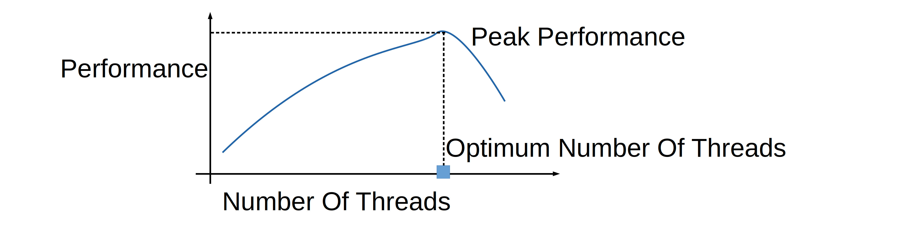

### [10] What is the difference between process and thread?

A process is an instance of a program at runtime, an independent entity that is allocated system resources.
(for example, CPU time and memory). Each process runs in a separate address space:
one process cannot access the variables and data structures of another. If a process wants to access other process's
resources, it must use inter-process communication.

A thread uses the same stack space as a process, and multiple threads use their shared data. Generally, each thread can
work (read and write) with the same area of memory, as opposed to processes that cannot simply access to the memory of
another process. Each thread has its own registers and its own stack, but other threads can use them.

A thread is a specific way of executing a process. When one thread modifies a process resource, this change is
immediately visible to other threads in that process.

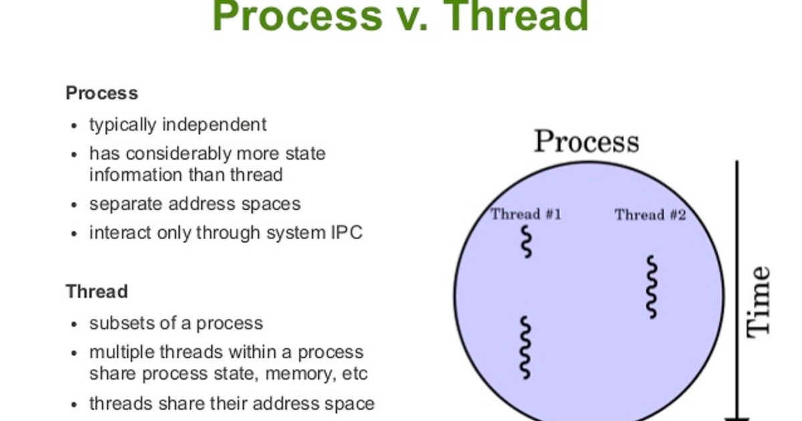

| Basis of comparison              | Process                                                                                                                                                                                                                                                                                                                                 | Flow                                                                                                                                                           |
|----------------------------------|-----------------------------------------------------------------------------------------------------------------------------------------------------------------------------------------------------------------------------------------------------------------------------------------------------------------------------------------|----------------------------------------------------------------------------------------------------------------------------------------------------------------|
| Definition                       | A process is a running program, i.e. an active program.                                                                                                                                                                                                                                                                                 | A thread is an entity within a process that can be scheduled to run (by scheduler).                                                                            |
| Context switch                   | Processes take longer to context switch because they are heavier and require more actions. When switching the execution of a thread of one process to a thread of another, the OS updates some processor registers that are responsible for virtual memory mechanisms, since different processes have different virtual address spaces. | Threads take less time to switch contexts because there is less information to store, clean up, and restore because threads operate in the same address space. |
| Sharing memory                   | Each process runs in a different address space: one process cannot access the variables and data structures of another.                                                                                                                                                                                                                 | All threads in a process share its virtual address space and system resources.                                                                                 |
| Communication                    | Communication between processes takes more time than between threads. If a process wants to access other process's resources, it must use [interprocess communication](#11-inter-process-communication).                                                                                                                                | Communication between threads takes less time than between processes.                                                                                          |
| Time of creation and termination | Processes take longer to create and complete. When the OS starts a program, it creates a process and creates a main thread to execute the program code. Also, when creating a process, memory is allocated, resources and libraries are loaded / copied.                                                                                | Thread is used in the same address space and does not require memory allocation and any loading.                                                               |

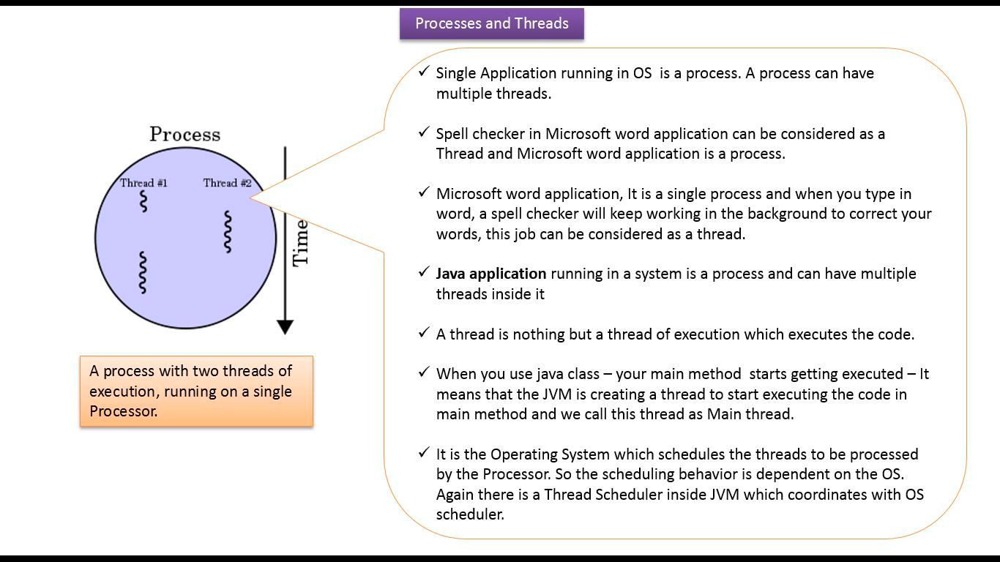

### [11] What does thread scheduling depend on?

Linux treats threads and not processes as the fundamental unit for execution. Hence, scheduling on Android concerns
threads and not processes.

Scheduling allocates execution time for threads on a processor. The scheduler decides which thread should execute and
for how long it should be allowed to execute before it picks a new thread to execute and a context switch occurs.

In Android, the application threads are scheduled by the standard scheduler _in the Linux kernel_ and not by the virtual
machine. In practice, this means that the threads in our application are competing not only directly with each other for
execution time, but also against all threads in all the other applications. The threads in the Background Group can’t
get more than ~5-10% execution time altogether.
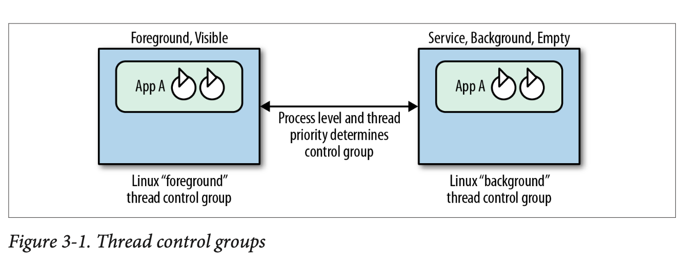

The Linux kernel scheduler is known as a _completely fair scheduler_ (CFS). It is “fair” in the sense that it tries to
balance the execution of tasks not only based on the _priority_ of the thread but also by _tracking the amount of
execution_ time (virtual runtime of a thread). If a thread doesn’t use the allocated time to execute, the CFS will
ensure that the priority is lowered so that it will get less execution time in the future.

The Linux CFS is designed to be fair to competing workloads sharing a common CPU resource. On Linux, the thread priority
is called _niceness_ or n*ice value*, which basically is an indication of how nice a certain thread should behave toward
other threads. The nice value ranges from -19 (least nice, or most CPU time allocated) to 20 (nicest, or least CPU time
allocated).

The mapping of Java priorities is an implementation detail and may vary depending on platform version. The niceness
mapping values in the table are from Jelly Bean.

| Thread.setPriority(int)  | Linux niceness |
|--------------------------|----------------|
| 1 (Thread.MIN_PRIORITY)  | 19             |
| 2                        | 16             |
| 3                        | 13             |
| 4                        | 10             |
| 5 (Thread.NORM_PRIORITY) | 0              |
| 6                        | -2             |
| 7                        | -4             |
| 8                        | -5             |
| 9                        | -6             |
| 10 (Thread.MAX_PRIORITY) | -8             |

### [12] What are Handler, Looper, MessageQueue for?

There is only one thread that updates the UI. We use other threads to run multiple tasks in the background. To update
the UI after execution, we need to send the result to the main or UI thread.

It is difficult to manage communication with a large group of threads. Android provides API to make communication
between threads easier.

Components:

- Looper
- Message Queue
- Handler
- Message

Looper is a kind of infinite loop that reads values from a queue and executes. It looks something like this:

```Kotlin
val queue: Queue<Runnable> = ArrayDeque()
while (true) {
    val runnable = queue.poll()
    runnable?.run()
}
```

In fact, Looper does not work with Queue<Runnable>, but with MessageQueue. In short, a MessageQueue is a queue with a
list of tasks that will be executed on a specific thread. It is similar to Queue<Runnable> but is a class that works
with Message objects.

Message contains the _task execution time_, a _link to the next Message_, and the _Runnable_ , that Lopper should
execute.

To put a task in a Looper, you need a Handler.

Handler - Consumer thread message processor, and the interface for a producer thread to insert messages into the queue.
A Looper can have many associated handlers, but they all insert messages into the same queue.

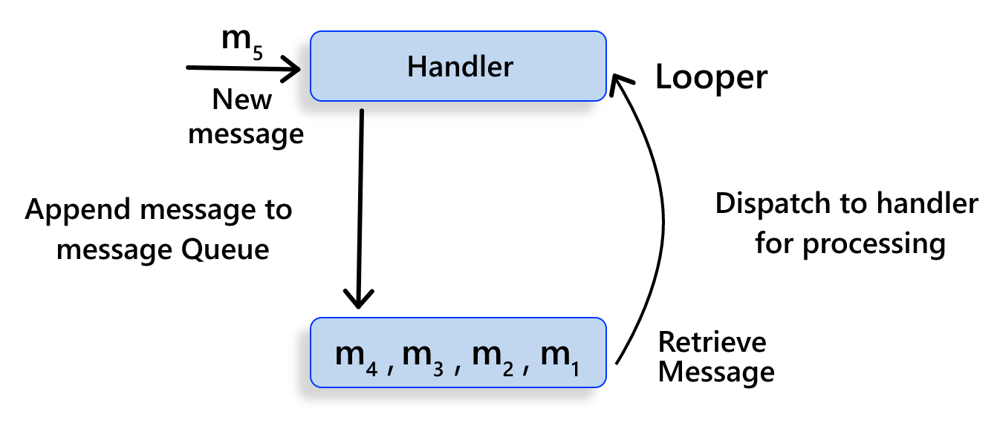

Only one Looper can be associated with a thread. Attaching another Looper to a Thread results in a RuntimeException.
Looper is responsible for keeping the thread alive.


[//]: # (### [9] Why can only the UI thread in Android update the UI?)

[//]: # (https://developer.android.com/guide/components/processes-and-threads.html + Java Concurrency)

[//]: # (### [9] Memory work)

[//]: # (### [11] Inter Process Communication)

[//]: # (Добавтить ссылку в 10 вопрос )

### [13] Which app startup states exist?

App launch can take place in one of three states: cold start, warm start, or hot start. . Each state affects how long it
takes for your app to become visible to the user. Two important metrics for determining app startup are time to initial
display (TTID) and time to fully drawn (TTFD). TTID is the time taken to display the first frame, and TTFD is the time
taken for the app to become fully interactive. Both are equally important, as TTFD lets the user know that the app is
loading, and TTFD is when the app is actually useable.

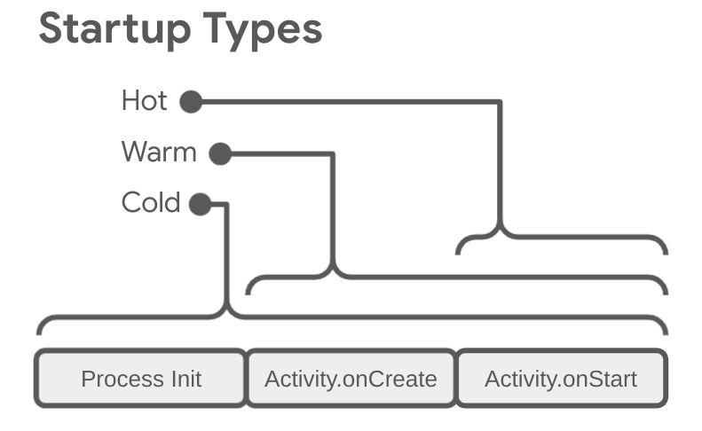

**Cold start**
At the beginning of a cold start, the system has the three following tasks:

- Load and launch the app.
- Display a blank starting window for the app immediately after launch.
- Create the app process. 

As soon as the system creates the app process, the app process is responsible for the next
  stages:
- Create the app object.
- Launch the main thread.
- Create the main activity.
- Inflate views.
- Layout the screen.
- Perform the initial draw.

When the app process completes the first draw, the system process swaps out the displayed background window, replacing
it with the main activity. At this point, the user can start using the app.
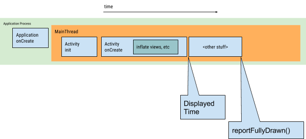

**Warm start**
The user backs out of your app but then re-launches it. The process might continue to run, but the app must recreate the
activity from scratch using a call to onCreate().

**Hot start**
If all of your app's activities are still resident in memory, then the app can avoid repeating object initialization,
layout inflation, and rendering.
However, if some memory is purged in response to memory trimming events, such as onTrimMemory(), then these objects need
to be recreated in response to the hot start event.

[Android vitals](#14-what-is-android-vitals) considers the following startup times for your app excessive:

- Cold startup takes 5 seconds or longer.
- Warm startup takes 2 seconds or longer.
- Hot startup takes 1.5 seconds or longer.

[Link](https://developer.android.com/topic/performance/vitals/launch-time)

### [14] What is Android Vitals?
Core metrics that affect the visibility of your app on Google Play. 

Core vitals:

- User-perceived ANR rate
- User-perceived crash rate

All other vitals:

- Excessive wakeups
- Stuck partial wake locks
- Excessive background Wi-Fi scans
- Excessive background network usage
- [App startup time](#13-which-app-startup-states-exist)
- Slow rendering
- Frozen frames
- Permission denials
  - High denial rates suggest that users don't think the additional exposure of their information is worth the benefits offered in return.

[Link](https://developer.android.com/topic/performance/vitals)


### [15] Which API should we use if we want to save data in the application?
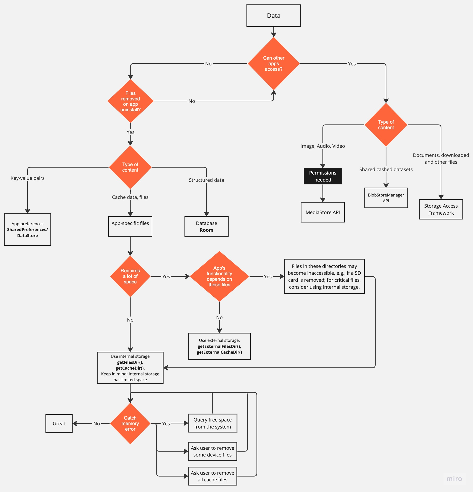

