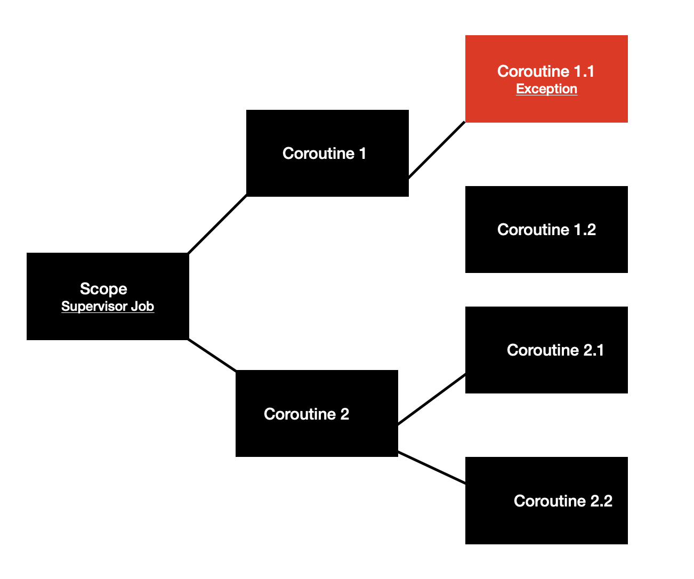

#### Difference between a "coroutine" and a "thread"?

1) Coroutines are a form of sequential processing: only one is executing at any given time. Threads are a form of
   concurrent processing: multiple threads may be executing at any given time.
2) The operating system switches running threads according to its scheduler, which is an algorithm in the operating
   system kernel. With coroutines, the programmer and programming language determine when to switch coroutines
3) Coroutines can provide a very high level of concurrency with very little overhead. Generally in a threaded
   environment you have at most 30-50 threads before the amount of overhead wasted actually scheduling these threads
   (by the system scheduler) significantly cuts into the amount of time the threads actually do useful work.
4) Coroutines run within a single thread or pool of threads.

***

#### What are the main components of coroutines? Describe their role

*Job, Context, Dispatcher, Continuation и CoroutineScope*

*Job* - Stores the state of the coroutine: active / canceled / completed. These states change as the coroutine runs. But
we also use coroutine state products on their own: to cancel the coroutine or start deferring the coroutine. Jobs can be
arranged into parent-child hierarchies where cancellation of a parent leads to immediate cancellation of all its
children recursively.

*CoroutineContext* - collection of unique Key-Element values. Should contain an instance of a job to enforce structured
concurrency.

*Dispatcher* - determines what thread or threads the coroutine uses for execution. The coroutine dispatcher can confine coroutine execution to a specific thread,
dispatch it to a thread pool, or let it run unconfined.

[//]: # (TODO)
*CoroutineScope* -

*Continuation* -

***

#### How the main components of coroutines depend on each other

[//]: # (TODO)

*CoroutineScope* store *CoroutineContext*. CoroutineContext it is a map with different objects that implement
CoroutineContext.Element. As example: Job, Dispatcher,

***

#### Coroutine exceptions handling

a)

 ```Kotlin
 try {
    doSmthSuspend()
} catch (exception: Exception) {
    if (exception is CancellationException) {
        throw exception
    }
}
 ```

b)

 ```Kotlin
val handler = CoroutineExceptionHandler { _, exception ->
    println("CoroutineExceptionHandler got $exception")
}

launch(handler) {
    throw AssertionError()
}

CoroutineExceptionHandler got java.lang.AssertionError
```

***

#### Why is it forbidden to catch CancellationException?

[//]: # (TODO)

***

#### What is suspension point? How coroutines state machine will divide this code?
!!!
[//]: # (TODO)

[//]: # (Suspension points are points in code which either end your program early &#40;mostly bad paths in programs&#41;, or which start some work on the side, in another routine which is suspended, ultimately notifying you of the end result, and allowing you to continue where you left off.)

 ```Kotlin
launch {
    doSmthSuspend1()
    toast("First task completed")
    doSmthSuspend2()
    toast("Second task completed")
}


```

1. doSmthSuspend1 and everything above
2. doSmthSuspend2 and everything between it and doSmthSuspend1
3. everything after doSmthSuspend2

***

#### How continuation.resume() set parameters to next continuation?
!!!
[//]: # (TODO поправить ошибку в логике)

 ```Kotlin
launch {
    val param = buildParam()
    val firstResult = doSmthSuspend1(param)
    doSmthSuspend2(firstResult)
}
```

continuation.resume(param)

*param* will be cast to required type

 ```
   Object invokeSuspend(Object result) {
        switch (label) {
            case 0: {
                label = 1;
                result = buildParam();
                if (result == COROUTINE_SUSPENDED) return COROUTINE_SUSPENDED;
            }
            case 1: {
                param = (String) result;
                if (result == COROUTINE_SUSPENDED) return COROUTINE_SUSPENDED;
            }
        }
    }
```

***

#### Difference between async and launch

*Launch* - Returns a Job and does not carry any resulting value.

*Async* - Creates a coroutine and returns its future result as an implementation of Deferred. It blocks the current
thread at the entry point of the *await()*.

***

#### Job types
!!!

*Job* - Creates a job object in an active state. A failure of any child of this job immediately causes 
this job to fail, too, and cancels the rest of its children.

*SupervisorJob* -To handle children failure independently of each other use SupervisorJob.
Children of a supervisor job can fail independently of each other. If parent job is specified, 
then this supervisor job becomes a child job of its parent and is cancelled when its parent fails or is cancelled. 
All this supervisor's children are cancelled in this case, too. The invocation of cancel with exception 
(other than CancellationException) on this supervisor job also cancels parent.

*Deferred* - it is a Job with a result. Deferred has the same state machine as the Job with additional convenience 
methods to retrieve the successful or failed result of the computation that was carried out. 
The result of the deferred is available when it is completed and can be retrieved by await method, 
which throws an exception if the deferred had failed.


***

#### Join, JoinAll, Await, AwaitAll

*Join* - Suspends current coroutine until the job completes.

*JoinAll* - Suspends current coroutine until all given jobs are complete. This method is semantically equivalent to
joining all given jobs one by one with

 ```Kotlin
jobs.forEach { it.join() }
 ```

*Await* - Deferred extension. Work with async. Awaits for completion of the promise without blocking. Return coroutine
result.

*AwaitAll* - Deferred extension. Work with async. Awaits for completion of given deferred values without blocking a
thread. Resumes normally with the list of values when all deferred works are completed or resumes with the first thrown
exception (including cancellation).

 ```Kotlin
val results: List<String> = listOf<Deferred<String>>().awaitAll()
 ```

***

#### What is CoroutineStart? Which types do you know?

 ```Kotlin
fun CoroutineScope.launch(
    context: CoroutineContext = EmptyCoroutineContext,
    start: CoroutineStart = CoroutineStart.DEFAULT,
    block: suspend CoroutineScope.() -> Unit
): Job
 ```

*CoroutineStart* defines start options for coroutines builders. It is used in start parameter of launch, async, and
other coroutine builder functions.

*DEFAULT* - immediately schedules coroutine for execution according to its context;

*ATOMIC* - atomically (in a non-cancellable way) schedules coroutine for execution according to its context;

*LAZY* - starts coroutine lazily, only when it is needed;

*UNDISPATCHED* - immediately executes coroutine until its first suspension point in the current thread.

***

#### How to cancel coroutine? What is ensureActive?

We can cancel job, and have to ensure that current scope is active by using *isActive* or *ensureActive()*

ensureActive() - If the job is no longer active, throws CancellationException. This method is a drop-in replacement for
the following code, but with more precise exception:

 ```Kotlin
 if (!isActive) {
    throw CancellationException()
}
 ```

 ```Kotlin
val job = CoroutineScope.launch {
    ensureActive()
    doSmth()
}
job.cancel()
 ```

***

#### How to put custom data to CoroutineContext

To coroutine Context we can put CoroutineContext.Element implementation. AbstractCoroutineContextElement - base class
for CoroutineContext.Element implementations.

 ```Kotlin
data class SharedData(
    val sharedInfo: Long,
) : AbstractCoroutineContextElement(UserData) {
    companion object Key : CoroutineContext.Key<UserData>
}

//then scope could be created as
val scope = CoroutineScope(Job() + Dispatchers.Default + SharedData("I have a secret for you"))
 ```

***
#### What is CoroutineDispatcher? Which types do you know?

The coroutine context includes a coroutine dispatcher that determines what thread or threads the coroutine uses for execution. 
The coroutine dispatcher can confine coroutine execution to a specific thread, 
dispatch it to a thread pool, or let it run unconfined.

*Dispatchers.Default* - It uses a common pool of shared background threads. It is backed by a shared pool 
of threads on JVM. By default, the maximum number of threads used by this dispatcher is equal 
to the number of CPU cores, but is at least two. Using for intensive computing.

*Dispatchers.IO* - uses a shared pool of on-demand created threads and is designed for blocking operations.
The thread limit is 64 (or more if processor cores are more than 64). Using for write/read/network work.

*Dispatchers.Unconfined* - is not confined to any specific thread. It executes the initial continuation 
of a coroutine in the current call-frame and lets the coroutine resume in whatever thread that is used 
by the corresponding suspending function, without mandating any specific threading policy.
Nested coroutines launched in this dispatcher form an event-loop to avoid stack overflows;


***
#### Why is Default not suitable for IO operations?


***
#### How to create private thread pool?

[//]: # (TODO)
Private thread pools can be created with *newSingleThreadContext* and *newFixedThreadPoolContext*.

***
#### What is ContinuationInterceptor?

[//]: # (TODO)


***

#### What is ContinuationInterceptor?

[//]: # (TODO)


***

#### What is Flow? When we have to use it?

[//]: # (TODO)


***

#### Which coroutines will be cancelled?


