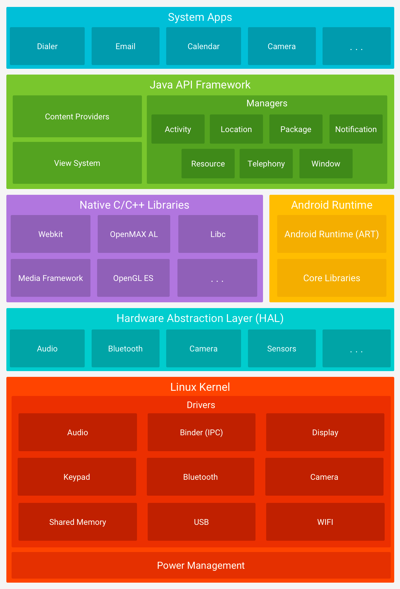
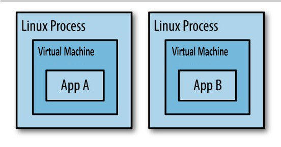

### [1] What is Android Software Stack. What are the major components of the Android platform?

Applications run on top of a software stack that is based on a Linux kernel, native C/C++ libraries, and a runtime that executes the application code.

From the top:

1. **System Apps**  - Android applications that are implemented in Java. They utilize both Java and Android framework libraries.
Android comes with a set of core apps for email, SMS messaging, calendars, internet browsing, contacts, and more.
If your app would like to deliver an SMS message, you don't need to build that functionality yourself—you can instead invoke whichever SMS app is already installed to deliver a message to the recipient you specify.

2. **Java API framework** - **The entire feature-set of the Android OS** is available to you **through APIs** written in the Java language.  
It contains Android classes that handle the window system, UI toolkit, resources, and so on—basically everything that is required to write an Android application in Java.
The framework **defines and manages the lifecycles** of the Android components and their intercommunication. It defines a set of Android-specific 
asynchronous mechanisms that applications can utilize to simplify the thread management: HandlerThread, AsyncTask, IntentService, AsyncQueryHandler, and etc. 

3. **Native C/C++ Libraries** - Many core Android system components and services, such as ART and HAL, are built from native code that require native libraries written in C and C++.
Java applications normally don’t interact directly with the native libraries because the Application framework provides Java wrappers for the native code.
If you are developing an app that requires C or C++ code, you can use the _Android NDK_ to access some of these native platform libraries directly from your native code.

    The Native Development Kit (NDK) - is a set of tools that allows you to use C and C++ code with Android. Allows you to build **performance-critical** parts of your app.
hen you build your project, this code is compiled into a native library that Gradle can package with your app.

4. **Android Runtime** - Each app runs in its own process ([App sandbox question](#3-what-is-app-sandbox)) and with its own instance of the Android Runtime.
Android Runtime is written to run multiple virtual machines on low-memory devices by executing DEX files.
DEX files - a bytecode format designed specially for Android that's optimized for minimal memory footprint. 
Build tools, such as d8, compile Java sources into DEX bytecode, which can run on the Android platform.

    Before Android version 5.0 (API level 21) it was Dalvik, but now its ART ([Dalvik vs ART](#2-difference-between-dalvik-and-art--what-is-profile-guided-compilation)).

5. **HAL (Hardware Abstraction Layer)** - provides standard interfaces that expose device hardware capabilities to the higher-level Java API Framework. 
The HAL consists of multiple library modules, each of which implements an interface for a specific type of hardware components, such as the camera or Bluetooth module, for example. 
**When a framework API makes a call** to access device hardware, the Android system **loads** the library module for that hardware component.

6. **Linux kernel** - The foundation of the Android platform. Android relies on the Linux kernel for underlying functionalities 
such as **threading** and **low-level memory management**. Linux kernel launch/fork a new process for every application, and every process 
**holds a runtime** with a running application. Also, within the process, multiple threads can execute the application code. 
The kernel splits the available CPU execution time for processes and their threads through _scheduling_.

### [2] Difference between *Dalvik* and *ART* ? What is Profile-Guided Compilation?
[//]: # (TODO https://medium.com/programming-lite/android-core-jvm-dvm-art-jit-aot-855039a9a8fa)

### [3] What is App Sandbox?

Applications execute in different processes and Virtual Machines. 
Each Android app lives in its own security sandbox. By default, every app runs in its own Linux process.
Each process has its own virtual machine (VM).

Each process has its own virtual machine (VM), so an app's code runs in isolation from other apps. By default, every app runs in its own
Linux process. The Android system starts the process when any of the app's components need to be executed, and then
shuts down the process when it's no longer needed or when the system must recover memory for other apps.

By default, the system assigns each app a unique Linux user ID (the ID is used only by the system and is unknown to the app). The system sets
permissions for all the files in an app so that only the user ID assigned to that app can access them. 
The Android system implements the principle of least privilege. That is, each app, by default, has access only to the components
that it requires to do its work and no more. This creates a very secure environment in which an app cannot access parts
of the system for which it is not given permission. 

To share data with other apps look [Inter Process Communication](#5-inter-process-communication-ipc)

It's possible to arrange for two apps to share the same Linux user ID (AndroidManifest - sharedUserID), in which case they are able to access each
other's files. To conserve system resources, apps with the same user ID can also arrange to run in the same Linux
process and share the same VM. The apps must also be signed with the same certificate.

### [4] Android build process
[//]: # (TODO https://medium.com/androiddevnotes/the-internals-of-android-apk-build-process-article-5b68c385fb20)

### [5] Inter process communication (IPC)

