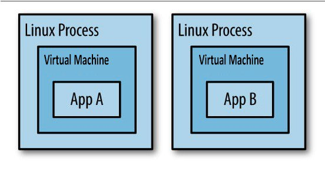
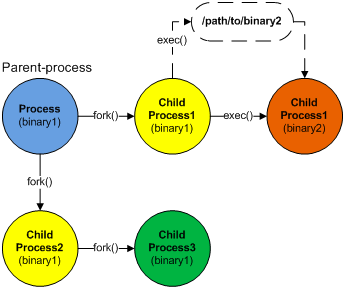

### [1] Что такое программный стек Android (Android Software Stack). Каковы основные компоненты архитектуры платформы Android?

Приложения работают поверх программного стека, основанного на ядре Linux, собственных библиотеках C/C++ и среде
выполнения, которая выполняет код приложения.

С верха стека:

1. **System Apps (Системные приложения)** - приложения написанные на Java и использующие библиотеки и фреймфорки из Java
   Api Frameworks. Содержит в себе предустановленный набор приложений, который можно переиспользовать. Например, если вы
   хотите отправить СМС,не нужно создавать этот функционал заново - можно использовать системное приложение.

2. **Java API Framework** -  **Весь набор функций ОС Android** доступен вам **через API**, написанные на языке Java. Он
   содержит классы Android, которые управляют интерфейсами (окнами) системы, компонентами графического интерфейса,
   ресурсами и т. д. — в основном все, что требуется для написания приложения Android на Java. Фреймфорк **определяет и
   управляет жизненными циклами** компонентов Android и их взаимодействие. Он определяет набор специфичных для Android
   асинхронных механизмов, которые приложения могут использовать для упрощения управления потоками: HandlerThread,
   AsyncTask, IntentService, AsyncQueryHandler и т. д.

3. **Native libraries (Системные библиотеки)** - библиотеки написанные на языках C/C++, которые работают непосредственно
   с графикой, шрифтами, системными ресурсами, базами данных и тд. Многие основные системные компоненты и службы
   Android, такие как ART и HAL, созданы из нативного кода, для которого требуются нативные библиотеки, написанные на C
   и C++. Приложения Java обычно не взаимодействуют напрямую с нативными библиотеками, поскольку среда приложений
   предоставляет Java-оболочки для нативного кода. Но если вы разрабатываете приложение, для которого требуется код C
   или C++, вы можете использовать _Android NDK_ для доступа к некоторым из этих нативных библиотек платформы.

   Native Development Kit (NDK) — это набор инструментов, который позволяет использовать код C и C++ с Android.
   Позволяет создавать **критичные для производительности** части вашего приложения. Если вы пишете нативный код, этот
   код компилируется в нативную библиотеку, которую Gradle может упаковать в ваш apk.

4. **Android Runtime (среда выполнения)** - Каждое приложение работает в своем собственном
   процессе ([Вопрос App Sandbox](#3----app-sandbox)) и с собственным экземпляром среды выполнения (Android Runtime).
   Среда выполнения Android предназначена для запуска нескольких виртуальных машин на устройствах с малым объемом памяти
   путем выполнения файлов DEX. Файлы DEX — формат байт-кода, разработанный специально для Android и оптимизированный
   для минимального использования памяти. Инструменты сборки, такие как d8, [компилируют](#4---) исходные коды Java в
   байт-код DEX, который может работать на платформе Android.

   До версии Android 5.0 (уровень API 21) Android Runtime использовал виртуальную машину Dalvik, но теперь это ART ([Dalvik vs ART](#2---dalvik--art-)).

5. **Hardware Abstraction Layer (уровень аппаратной абстракции)** предоставляет стандартные интерфейсы, которые
   предоставляют аппаратные возможности устройства высокоуровневой Java API Framework. HAL состоит из нескольких
   библиотечных модулей, каждый из которых реализует интерфейс для определенного типа аппаратных компонентов, таких как,
   например, камера или модуль Bluetooth. Когда приложение обращается к аппаратному API, система Android загружает
   библиотечный модуль для этого аппаратного компонента.

6. Linux kernel (ядро Linux) -  Основа платформы Android. Android полагается на ядро Linux для базовых функций,
   таких как **управление потоками** и **низкоуровневого управление памятью**. Ядро Linux запускает процесс (ответвляет от родительского) для каждого приложения. Каждый процесс
   **содержит среду выполнения** с работающим приложением. Кроме того, внутри процесса несколько потоков могут выполнять код приложения.
   Ядро распределяет доступное время выполнения ЦП для процессов и их потоков с помощью планирования (_scheduling_).

### [2] Разница между *Dalvik* и *ART* ?

### [3] Что такое песочница (App Sandbox)?

Приложения выполняются в разных процессах и виртуальных машинах.
Каждое Android-приложение живет в собственной песочнице. По умолчанию каждое приложение работает в своем собственном процессе Linux.
Каждый процесс имеет свою виртуальную машину (ВМ).

У каждого процесса есть собственная виртуальная машина (ВМ), поэтому код приложения выполняется изолированно от других приложений. 
Система Android запускает процесс, когда необходимо выполнить любой из компонентов приложения, 
а затем останавливает процесс, когда он больше не нужен.

По умолчанию система назначает каждому приложению уникальный идентификатор пользователя (userId) Linux (идентификатор используется только системой и неизвестен приложению). 
Система устанавливает разрешения для всех файлов в приложении, чтобы только идентификатор пользователя, назначенный этому приложению, мог получить к ним доступ.
Андроид система реализует принцип наименьших привилегий. То есть каждое приложение по умолчанию имеет доступ только к компонентам
что он требует для выполнения своей работы и не более того. Это создает очень безопасную среду, в которой приложение не может получить доступ к частям
системы, для которой ему не дано разрешение.

Чтобы делиться данными с другими приложениями, изучите [Межпроцессонрная коммуникация](#5---inter-process-communication---ipc)

Два приложения могут использовать один и тот же идентификатор пользователя Linux (AndroidManifest — sharedUserID), и в этом случае они смогут получить доступ к ресурсам друг друга. 
Для экономии системных ресурсов приложения с одним и тем же идентификатором пользователя также могут запускаться в одном и том же Linux процессе и ВМ. 
Приложения также должны быть подписаны одним и тем же сертификатом.

### [4] Процесс сборки приложения

### [5] Межпроцессонрная коммуникация (Inter Process Communication - IPC)

### [6] Как происходит процесс запуска приложения
Приложение запускается, когда один из его компонентов (Activity, Service, BroadcastReceiver, ContentProvider) инициируется для выполнения. 
Любой компонент может быть точкой входа для приложения, и как только запускается первый компонент, запускается процесс Linux (если он еще не запущен), 
что приводит к следующей последовательности запуска:

1. Запускается процесс Linux
2. Создается Android Runtime (среда выполнения)
3. Создается экземпляр класса Application
4. Создается компонент точки входа в приложение

Настройка нового процесса Linux и среды выполнения не является мгновенной операцией. Это может снизить 
производительность и оказать заметное влияние на пользовательский опыт. Таким образом, система пытается 
сократить время запуска Android-приложений, запуская при загрузке системы специальный процесс под названием Zygote. 

Что делает Zygote? Для того чтобы ответить на этот вопрос, нужно понять как работают процессы.

На самом раннем этапе загрузки ОС Linux, а именно, в момент загрузки ядра создается самый первый процесс —
swapper или sched (процесс имеющий Process ID = 0). 
Каждый процесс может создавать новые процессы (child process), по отношению к которым он будет 
предком-родителем, через функцию fork.

Эффективный и быстрый запуск приложения достигается за счет того, что Zygote начинает с предварительной загрузки 
всех классов и ресурсов, которые потенциально могут понадобиться приложению во время выполнения, в память системы.
При запуске приложения происходит fork от процесса Zygote. Он служит родителем для всех приложений Android.

В Zygote предустановлен весь набор основных библиотек. Новые процессы приложений разветвляются из процесса Zygote без копирования основных библиотек, которые являются общими для всех приложений.

Fork предполагает создание нового процесса, который является точной копией родительского процесса. На самом деле он ничего не копирует, вместо этого 
он отображает ресурсы нового процесса как ресурсы родительского процесса и делает копии только тогда, когда новый процесс что то изменяет.

[Подробнее: Жизненный цикл процессов Linux](https://www.okbsapr.ru/library/publications/kanner_2015_3/)

### [7] Что такое приоритеты процессов (process ranking)?

В системе Android используется  Low Memory Killer Daemon (LMK) ([Link](https://source.android.com/docs/core/perf/lmkd)).

Low Memory Killer — процесс отслеживает состояние памяти работающей системы Android и реагирует на нехватку/переполнение памяти,
убивая наименее важные процессы, чтобы поддерживать производительность системы на приемлемом уровне.

Основной причиной введения LMK в Android был OOM (out of memory) Killer, иногда убивающий высокоприоритетный процесс
(например приложения переднего плана) в условиях нехватки памяти. LMK же знает приоритет процессов, 
и за счет этого в первую очередь уничтожаются пустые процессы, а не видимые.

Приоритеты процессов:

1. **Foreground process (Процесс переднего плана)**

   Приложение имеет видимый компонент впереди, Service привязаный к видимой Activity или запущенный BroadcastReceiver.
2. **Visible Process (Видимый процесс)**

   Приложение имеет видимый компонент, но частично скрыт.
3. **Service Process (Процесс с запущенным Service)**

   Service выполняется в фоновом режиме и не привязан к видимому компоненту.
4. **Background process (Фоновый процесс)**

   Невидимая Activity. Это уровень процесса, в котором находятся большинство приложений.
5. **Empty Process (Пустой процесс)**

   Процесс без активных компонентов. Пустые процессы сохраняются, чтобы сократить время запуска, но они уничтожаются первыми
   когда система высвобождает ресурсы.

В системе может быть запущено несколько процессов приложений, даже если пользователь воспринимает их как завершенные.
Пустые процессы сохраняются (если это позволяют системные ресурсы), чтобы сократить время запуска при повторном обращении 
к соответствующему приложению.
