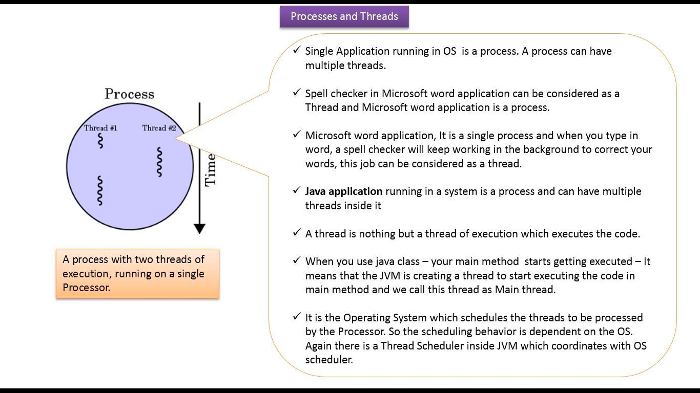

### [1] Что такое программный стек Android (Android Software Stack). Каковы основные компоненты архитектуры платформы Android?

Приложения работают поверх программного стека, основанного на ядре Linux, собственных библиотеках C/C++ и среде
выполнения, которая выполняет код приложения.


С верха стека:

1. **System Apps (Системные приложения)** - приложения написанные на Java и использующие библиотеки и фреймфорки из Java
   Api Frameworks. Содержит в себе предустановленный набор приложений, который можно переиспользовать. Например, если вы
   хотите отправить СМС,не нужно создавать этот функционал заново - можно использовать системное приложение.

2. **Java API Framework** -  **Весь набор функций ОС Android** доступен вам **через API**, написанные на языке Java. Он
   содержит классы Android, которые управляют интерфейсами (окнами) системы, компонентами графического интерфейса,
   ресурсами и т. д. — в основном все, что требуется для написания приложения Android на Java. Фреймфорк **определяет и
   управляет жизненными циклами** компонентов Android и их взаимодействие. Он определяет набор специфичных для Android
   асинхронных механизмов, которые приложения могут использовать для упрощения управления потоками: HandlerThread,
   AsyncTask, IntentService, AsyncQueryHandler и т. д.

3. **Native libraries (Системные библиотеки)** - библиотеки написанные на языках C/C++, которые работают непосредственно
   с графикой, шрифтами, системными ресурсами, базами данных и тд. Многие основные системные компоненты и службы
   Android, такие как ART и HAL, созданы из нативного кода, для которого требуются нативные библиотеки, написанные на C
   и C++. Приложения Java обычно не взаимодействуют напрямую с нативными библиотеками, поскольку среда приложений
   предоставляет Java-оболочки для нативного кода. Но если вы разрабатываете приложение, для которого требуется код C
   или C++, вы можете использовать _Android NDK_ для доступа к некоторым из этих нативных библиотек платформы.

   Native Development Kit (NDK) — это набор инструментов, который позволяет использовать код C и C++ с Android.
   Позволяет создавать **критичные для производительности** части вашего приложения. Если вы пишете нативный код, этот
   код компилируется в нативную библиотеку, которую Gradle может упаковать в ваш apk.

4. **Android Runtime (среда выполнения)** - Каждое приложение работает в своем собственном
   процессе ([Вопрос App Sandbox](#3----app-sandbox)) и с собственным экземпляром среды выполнения (Android Runtime).
   Среда выполнения Android предназначена для запуска нескольких виртуальных машин на устройствах с малым объемом памяти
   путем выполнения файлов DEX. Файлы DEX — формат байт-кода, разработанный специально для Android и оптимизированный
   для минимального использования памяти. Инструменты сборки, такие как d8, [компилируют](#4---) исходные коды Java в
   байт-код DEX, который может работать на платформе Android.

   До версии Android 5.0 (уровень API 21) Android Runtime использовал виртуальную машину Dalvik, но теперь это
   ART ([Dalvik vs ART](#2---dalvik--jvm----dvm---art)).

5. **Hardware Abstraction Layer (уровень аппаратной абстракции)** предоставляет стандартные интерфейсы, которые
   предоставляют аппаратные возможности устройства высокоуровневой Java API Framework. HAL состоит из нескольких
   библиотечных модулей, каждый из которых реализует интерфейс для определенного типа аппаратных компонентов, таких как,
   например, камера или модуль Bluetooth. Когда приложение обращается к аппаратному API, система Android загружает
   библиотечный модуль для этого аппаратного компонента.

6. Linux kernel (ядро Linux) - Основа платформы Android. Android полагается на ядро Linux для базовых функций, таких
   как **управление потоками** и **низкоуровневого управление памятью**. Ядро Linux запускает процесс (ответвляет от
   родительского) для каждого приложения. Каждый процесс
   **содержит среду выполнения** с работающим приложением. Кроме того, внутри процесса несколько потоков могут выполнять
   код приложения. Ядро распределяет доступное время выполнения ЦП для процессов и их потоков с помощью планирования (_
   scheduling_).

### [2] Почему создали Dalvik взамен JVM? Почему отказались от DVM в пользу ART?

**Java Virtual Machine vs Dalvik Virtual Machine:**

- DVM был разработан для работы с устройствами имеющими небольшой объем памяти.
- JVM использует байт-код Java и запускает файл «.class», где DVM использует свой собственный байт-код и запускает файл
  ‘.dex’.
- В JVM один экземпляр JVM используется совместно с несколькими приложениями, a DVM был разработан таким образом, чтобы
  устройство могло эффективно запускать несколько экземпляров виртуальной машины, предоставляея каждому приложению
  собственный экземпляр DVM.
- JVM поддерживает несколько операционных систем, DVM поддерживает только операционную систему Android.
- В JVM исполняемым файлом является JAR, а в DVM исполняемым файлом является APK.


_Основная причина использования DVM в Android заключается в том, что DVM занимает меньше памяти, работает и загружается
быстрее по сравнению с JVM._

**ART vs DVM**

- **DVM использует компиляцию JIT (Just in Time)**

  Приложение компилируется каждый раз, когда запускается.
- **ART использует компиляцию AOT (Ahead-of-Time).**

  Приложение компилируется только один раз. На этапе установки приложения AOT (Ahead-of-Time)
  статически переводит байт-код DEX в машинный код и сохраняет в памяти устройства. Это разовое событие и происходит
  только тогда, когда приложение устанавливается на устройство. Это приводит к увеличению времени автономной работы и
  высокой производительности. Так нет необходимости в JIT-компиляции, приложение запускается намного быстрее.

- **Garbage collector.**

  Одна из основных причин плохого UX, плохого отклика и, в конечном итоге, плохих отзывов. Во времена Dalvik GC
  использовал иметь два прохода по куче, что приводило к плохому UX. В ART GC улучшен, и использует только один
  проход. [Android GC](#8---garbage-collector--gc--android)

- ART _уменьшает время запуска приложений_ и _улучшает работу батареи_.

  Так как код компилируется во время установки приложения, скорость запуска приложения будет выше, так как нет
  необходимости в компиляции при запуске. За счет этого меньше расходуется батарея. Однако есть и недостатки.
  _Время установки приложения увеличилось_ и (поскольку собственный машинный код, сгенерированный при установке,
  сохраняется во внутреннюю память) _требуется больше внутренней памяти_.

Чтобы решить эти недостатки, в Android Nougat JIT (Just In Time) была возвращена, и объеденена с AOT, что сделало его **
гибридным**. Используя гибридную среду выполнения (Hybrid Runtime), во время установки не будет выполняться компиляция.
Для часто используемых методов используется AOT, для редко JIT.

[Link: Android Core: JVM, DVM, ART, JIT, AOT](https://medium.com/programming-lite/android-core-jvm-dvm-art-jit-aot-855039a9a8fa)

[Link: How ART works](https://source.android.com/docs/core/runtime/configure)

[Video: How Dalvik and ART work?](https://www.youtube.com/watch?v=0J1bm585UCc)

### [3] Что такое песочница (App Sandbox)?

Приложения выполняются в разных процессах и виртуальных машинах. Каждое Android-приложение живет в собственной
песочнице. По умолчанию каждое приложение работает в своем собственном процессе Linux. Каждый процесс имеет свою
виртуальную машину (ВМ).


У каждого процесса есть собственная виртуальная машина (ВМ), поэтому код приложения выполняется изолированно от других
приложений. Система Android запускает процесс, когда необходимо выполнить любой из компонентов приложения, а затем
останавливает процесс, когда он больше не нужен.

По умолчанию система назначает каждому приложению уникальный идентификатор пользователя (userId) Linux (идентификатор
используется только системой и неизвестен приложению). Система устанавливает разрешения для всех файлов в приложении,
чтобы только идентификатор пользователя, назначенный этому приложению, мог получить к ним доступ. Андроид система
реализует принцип наименьших привилегий. То есть каждое приложение по умолчанию имеет доступ только к компонентам что он
требует для выполнения своей работы и не более того. Это создает очень безопасную среду, в которой приложение не может
получить доступ к частям системы, для которой ему не дано разрешение.

Чтобы делиться данными с другими приложениями,
изучите [Межпроцессонрная коммуникация](#5---inter-process-communication---ipc)

Два приложения могут использовать один и тот же идентификатор пользователя Linux (AndroidManifest — sharedUserID), и в
этом случае они смогут получить доступ к ресурсам друг друга. Для экономии системных ресурсов приложения с одним и тем
же идентификатором пользователя также могут запускаться в одном и том же Linux процессе и ВМ. Приложения также должны
быть подписаны одним и тем же сертификатом.

### [4] Процесс сборки приложения

### [5] Межпроцессорная коммуникация (Inter Process Communication - IPC)

### [6] Как происходит процесс запуска приложения

Приложение запускается, когда один из его компонентов (Activity, Service, BroadcastReceiver, ContentProvider)
инициируется для выполнения. Любой компонент может быть точкой входа для приложения, и как только запускается первый
компонент, запускается процесс Linux (если он еще не запущен), что приводит к следующей последовательности запуска:

1. Запускается процесс Linux
2. Создается Android Runtime (среда выполнения)
3. Создается экземпляр класса Application
4. Создается компонент точки входа в приложение

Настройка нового процесса Linux и среды выполнения не является мгновенной операцией. Это может снизить
производительность и оказать заметное влияние на пользовательский опыт. Таким образом, система пытается сократить время
запуска Android-приложений, запуская при загрузке системы специальный процесс под названием Zygote.

Что делает Zygote? Для того чтобы ответить на этот вопрос, нужно понять как работают процессы.

На самом раннем этапе загрузки ОС Linux, а именно, в момент загрузки ядра создается самый первый процесс — swapper или
sched (процесс имеющий Process ID = 0). Каждый процесс может создавать новые процессы (child process), по отношению к
которым он будет предком-родителем, через функцию fork.


Эффективный и быстрый запуск приложения достигается за счет того, что Zygote начинает с предварительной загрузки всех
классов и ресурсов, которые потенциально могут понадобиться приложению во время выполнения, в память системы. При
запуске приложения происходит fork от процесса Zygote. Он служит родителем для всех приложений Android.

В Zygote предустановлен весь набор основных библиотек. Новые процессы приложений разветвляются из процесса Zygote без
копирования основных библиотек, которые являются общими для всех приложений.

Fork предполагает создание нового процесса, который является точной копией родительского процесса. На самом деле он
ничего не копирует, вместо этого он отображает ресурсы нового процесса как ресурсы родительского процесса и делает копии
только тогда, когда новый процесс что то изменяет.

[Подробнее: Жизненный цикл процессов Linux](https://www.okbsapr.ru/library/publications/kanner_2015_3/)

### [7] Что такое приоритеты процессов (process ranking)?

В системе Android используется Low Memory Killer Daemon (LMK) ([Link](https://source.android.com/docs/core/perf/lmkd)).

Low Memory Killer — процесс который отслеживает состояние памяти работающей системы Android и реагирует на
нехватку/переполнение памяти, убивая наименее важные процессы, чтобы поддерживать производительность системы на
приемлемом уровне.

Основной причиной введения LMK в Android был OOM (out of memory) Killer, иногда убивающий высокоприоритетный процесс
(например приложения переднего плана) в условиях нехватки памяти. LMK же знает приоритет процессов, и за счет этого в
первую очередь уничтожаются пустые процессы, а не видимые.

Приоритеты процессов:

1. **Foreground process (Процесс переднего плана)**

   Приложение имеет видимый компонент впереди, Service привязаный к видимой Activity или запущенный BroadcastReceiver.
2. **Visible Process (Видимый процесс)**

   Приложение имеет видимый компонент, но частично скрыт.
3. **Service Process (Процесс с запущенным Service)**

   Service выполняется в фоновом режиме и не привязан к видимому компоненту.
4. **Background process (Фоновый процесс)**

   Невидимая Activity. Это уровень процесса, в котором находятся большинство приложений.
5. **Empty Process (Пустой процесс)**

   Процесс без активных компонентов. Пустые процессы сохраняются, чтобы сократить время запуска, но они уничтожаются
   первыми когда система высвобождает ресурсы.

В системе может быть запущено несколько процессов приложений, даже если пользователь воспринимает их как завершенные.
Пустые процессы сохраняются (если это позволяют системные ресурсы), чтобы сократить время запуска при повторном
обращении к соответствующему приложению.

### [8] Как работает Garbage collector? Какой GC использует Android?

### [9] Увеличивает ли количество потоков производительность?

**Введение:**

На уровне операционной системы поток имеет instruction pointer и stack pointer. Instruction pointer ссылается на
следующую задачу для обработки, а указатель стека ссылается на частную область памяти —_недоступную для других потоков_—
где хранятся данные потока.

ЦП может обрабатывать один поток за раз, но система обычно имеет несколько потоков, которым требуется обработка
одновременно. Поэтому ЦП должен распределять время обработки между потоками приложения. Распределением времени между
потоками занимается _планироовщиком (scheduler)_. Он определяет, какой поток процессор должен обрабатывать и как долго.
Стратегия планирования может быть реализована в различными способами, но в основном это зависит от приоритета потока (от
1 до 10):
поток с высоким приоритетом получает больше времени выполнения, чем поток с низким приоритетов.

Смена потока планировщиком называется _переключение контекста (context switch)_. При переключении контекста происходит

1. Сохранение состояния исполняемого потока (чтобы возобновить работу позже)
2. Восстановление состояния (контекста) только что запланированного потока.

Это занимает время. Чем больше времени потрачено процессором на переключение контекста, тем меньше доступно вашей
программе.

Это одна из причин, почему планировщики предоставляют каждому работоспособному потоку определенный _минимальный квант
времени_, даже когда многие другие потоки ожидают: этим амортизируется стоимость переключения контекста и его
последствия в течение большего непрерывного времени выполнения, улучшая общую пропускную способность (за счет некоторого
снижения отзывчивости).

**Ответ:**

Наша работа займет больше времени, если мы создадим тысячи потоков, так как нам придется тратить время на переключение
между их контекстами. Слишком много потоков может иметь два отрицательных эффекта.

Во-первых, когда фиксированное количество работы распределяется между большим количеством потоков, каждый поток получает
так мало работы, что накладные расходы, связанные с инициированием и остановкой потоков снижают эффективность.

Во-вторых, выполнение чрезмерного количества потоков приводит к накладным расходам из-за того что они конкурирую за
ограниченные аппаратные ресурсы.


### [10] Разница между процессов и потоком

Процесс — экземпляр программы во время выполнения, независимый объект, которому выделены системные ресурсы
(например, процессорное время и память). Каждый процесс выполняется в отдельном адресном пространстве:
один процесс не может получить доступ к переменным и структурам данных другого. Если процесс хочет получить доступ к
чужим ресурсам, необходимо использовать межпроцессное взаимодействие.

Поток использует то же самое пространства стека, что и процесс, а множество потоков совместно используют данные своих
состояний. Как правило, каждый поток может работать (читать и писать)
с одной и той же областью памяти, в отличие от процессов, которые не могут просто так получить доступ к памяти другого
процесса. У каждого потока есть собственные регистры и собственный стек, но другие потоки могут их использовать.

Поток — определенный способ выполнения процесса. Когда один поток изменяет ресурс процесса, это изменение сразу же
становится видно другим потокам этого процесса.


| Основа сравнения             | Процесс                                                                                                                                                                                                                                                                                                                                                                                | Поток                                                                                                                                                                                              |
|------------------------------|----------------------------------------------------------------------------------------------------------------------------------------------------------------------------------------------------------------------------------------------------------------------------------------------------------------------------------------------------------------------------------------|----------------------------------------------------------------------------------------------------------------------------------------------------------------------------------------------------|
| Определение                  | Процесс — это выполняемая программа, т. е. активная программа.                                                                                                                                                                                                                                                                                                                         | Поток — это сущность внутри процесса, выполнение которой можно запланировать                                                                                                                       |
| Время переключения контекста | Процессы требуют больше времени для переключения контекста, поскольку они тяжелее, и требуют больше действий. При переключении выполнения потока одного процесса, на поток другого, ОС обновляет некоторые регистры процессора, которые ответственны за механизмы виртуальной памяти, так как разные процессы имеют разное виртуальное адресное пространство.                          | Потокам требуется меньше времени для переключения контекста, поскольку меньше информации которую нужно сохранять, очищать и восстанавливать, так как потоки работают в одно адресном пространстве. |
| Общий доступ к памяти        | Каждый процесс выполняется в отдельном адресном пространстве: один процесс не может получить доступ к переменным и структурам данных другого.                                                                                                                                                                                                                                          | Все потоки процесса совместно используют его виртуальный адресное пространство и системные ресурсы.                                                                                                |
| Коммуникациия                | Общение между процессами требует больше времени, чем между потоками. Если процесс хочет получить доступ к чужим ресурсам, необходимо использовать [межпроцессное взаимодействие](#11---inter-process-communication).                                                                                                                                                                   | Общение между потоками требует меньше времени, чем между процессами.                                                                                                                               |
| Время создания и уничтожения | Процессы требуют больше времени для создания и завершения. Когда ОС запускает программу, она создает процесс для получения виртуальной памяти и создает основной поток для выполнения программного кода. Также при создании процесса выделяется память, происходит подгрузка/копирование ресурсов и библиотек. Поток использует в том же адресном пространстве, и не требует подкачки. | Потоки требуют меньше времени для создания и завершения, поскольку ,                                                                                                                               |



### [11] От чего зависит планирование потока?

Linux рассматривает потоки, а не процессы, как основную единицу выполнения. Следовательно, Scheduler планирует потоки, а
не процессы.

Планирование распределяет время выполнения потоков процессором. Планировщик решает, какой поток должен выполняться и как
долго ему позволено выполняться, прежде чем он выберет новый поток для выполнения и произойдет переключение контекста.

В Android потоки приложений планируются стандартным планировщиком _в ядре Linux_, а не виртуальной машиной. На практике
это означает, что потоки в нашем приложении конкурируют не только напрямую друг с другом, но и со всеми потоками во всех
других приложениях. Однако потоки в фоновой группе не могут получить более ~5-10% времени выполнения.


Планировщик ядра Linux известен как _полностью честный планировщик_ (completely fair scheduler - CFS). Он «справедлив» в
том смысле, что пытается балансировать выполнение задач не только на основе _приоритета_ потока, но и учаитывая _
количества процессорного мнения выделенного ранее_ (virtual runtime of a thread). Поскольку если отдавать процессорное
время только потокам с выскоким приоритетом, потоки с более низким приоритетом будут простаивать.

В Linux приоритет потока называется _niceness_ или *nice value*, что в основном указывает на то, насколько "любезно"
определенный поток должен вести себя по отношению к другим потокам. Значение nice находится в диапазоне от -19 (наименее
любезное, и ему выделяется больше всего процессорного времени) до 20 (наиболее любезный, и ему выделяется наименьшее
время процессора).

Соответствие приоритетов Java зависит от реализации и может различаться в зависимости от версии платформы. Значения ниже
корректны для Jelly Bean.

| Thread.setPriority(int)  | Linux niceness |
|--------------------------|----------------|
| 1 (Thread.MIN_PRIORITY)  | 19             |
| 2                        | 16             |
| 3                        | 13             |
| 4                        | 10             |
| 5 (Thread.NORM_PRIORITY) | 0              |
| 6                        | -2             |
| 7                        | -4             |
| 8                        | -5             |
| 9                        | -6             |
| 10 (Thread.MAX_PRIORITY) | -8             |

### [12] Для чего нужны Handler, Looper, MessageQueue?

Поскольку есть только один поток, который обновляет пользовательский интерфейс, мы используем другие потоки для
выполнения нескольких задач в фоновом режиме. Но, чтобы обновить пользовательский интерфейс после выполнения, нам нужно
отправить результат в основной поток или поток пользовательского интерфейса.

Будет сложно управлять связью со всеми этими потоками, если вы управляете большой группой потоков. Таким образом,
Android предоставил обработчики, чтобы упростить взаимодействие между потоками.

Компоненты:

- Looper
- Message Queue
- Handler
- Message

Looper - своего рода бесконечный цикл, который читает из очереди значения и выполняет. В паттерне
потребитель-производитель (consumer-producer), поток с Looper является потребителем, и получается что то вроде:

```Kotlin
val queue: Queue<Runnable> = ArrayDeque()
while (true) {
    val runnable = queue.poll()
    runnable?.run()
}
```

На самом деле Looper работает не с Queue<Runnable>, а с MessageQueue. Кратко говоря, MessageQueue — это очередь со
списком задач, которые будут выполняться в определенном потоке. Он похож на Queue<Runnable>, но является отдельным
классом, который работает с объектами Message.

Message содержит в себе время выполнения задачи, ссылку на следующий Message, и сам Runnable который должен выполнить
Lopper.

Чтобы поместить задачу в Looper, понадобится Handler.

Handler - обработчик сообщений для потока-потребителя и интерфейс для потока-производителя, позволяющий помещать Message
в очередь. Looper может иметь много Handler, но все они вставляют сообщения в одну и ту же очередь.


С потоком может быть связан только один Looper. Присоединение другого Looper к Thread приводит к
RuntimeException. Использование статического объекта ThreadLocal в классе Looper гарантирует, что к потоку будет
присоединен только один Looper. Looper отвечает за сохранение поток живым.

[Как работает UI в Android](https://habr.com/ru/articles/665806/)


[//]: # (### [11] Межпроцессорная коммуникация &#40;Inter-process communication&#41;)

[//]: # (Добавить ссылку в 10 вопрос )
