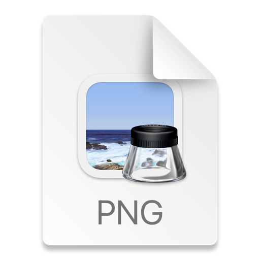

#### Is there a limit on the size of the bundle?

When used to pass information between Android components the bundle is serialized into a binder transaction. The Binder
transaction buffer has a limited fixed size, currently 1MB, which is shared by all transactions in progress for the
process. Since this limit is at the process level rather than at the per activity level, these transactions include all
binder transactions in the app such as onSaveInstanceState, startActivity and any interaction with the system. When the
size limit is exceeded, a TransactionTooLargeException is thrown.

For the specific case of savedInstanceState, the amount of data should be kept small because the system process needs to
hold on to the provided data for as long as the user can ever navigate back to that activity
(even if the activity's process is killed). Recommended size less than 50k.

***

#### Способы общения между процессами

1) Intent + Bundle
2) ContentProvider
3) Messenger

Messenger - клиент серверное взаимодействие. Процесс-клиент посылает данные на процесс-сервер.
Работает с bindServices которые живут в другом процессе.


4) Socket-NDK

Все они под капотом используют Binder

***


#### What is the Binder transaction?

Binder is the main IPC/RPC (Inter-Process Communication) system in Android. It allows applications to communicate with
each other, and it is the base of several important mechanisms in the Android environment. For instance, Android
services are built on top of Binder. Message exchanged with Binder are called binder transactions, they can transport
simple data such as integers but also process more complex structures like file descriptors, memory buffers or
weak/strong references on objects.

[Link](https://boosty.to/androidbroadcast/posts/904c5065-6c7e-4f75-b8e6-20cb8a607170)

#### What processor does Android use?

[Link](https://habr.com/ru/post/140459/)

***

#### Why we don't use JVM on Android?

[Link](https://towardsdatascience.com/jvm-vs-dvm-b257229d18a2)
[Link2](https://www.youtube.com/watch?v=duO5qgn2DO8)


***

#### Как вырезать фигуру из вьюшки

***

#### What is *Zygote* ?

[//]: # (Чтобы разместить все необходимое в оперативной памяти, Android пытается разделить страницы оперативной памяти между )

[//]: # (процессами. Это можно сделать следующими способами:)

[//]: # ()
[//]: # ([TODO]&#40;https://developer.android.com/topic/performance/memory-overview&#41;)

Каждое приложение запускается в отдельном процессе. Это сделано для того, чтобы процессы не могли иметь доступ к памяти друг друга, и следовательно,
никто не сможет получить доступ к нашим данным.

На самом раннем этапе загрузки ОС Linux, а именно, в момент загрузки ядра создается самый первый процесс — 
swapper или sched (процесс имеющий Process ID = 0).

Сами процессы в ходе своей жизни могут пребывать в следующих состояниях: 
1) состояние выполнения (running)
2) состояние сна (uninterruptible/interruptible sleep)
3) состояние остановки выполнения (stopped)
4) zombie-состояние


При этом в процессе выполнения каждый процесс может создавать новые процессы (child process), 
по отношению к которым он будет предком-родителем, через fork/exec


Zygote - специальный системный процесс, от которого мы запускаем процессы своего прложения.
Zygote уже содержит все необходимое для функционирования нашего приложения.
Через fork копируем родительский процесс, с отличным UID (User identifier).


[Link](https://www.okbsapr.ru/library/publications/kanner_2015_3/)

***

#### Difference between *Dalvik* and *ART* ? What is Profile-Guided Compilation?

Dalvik - JIT 

ART- AOT 

JIT - takes less RAM, but runtime is much slower 

AOT - takes a lot of RAM, but runtime works is 20 time more efficient 

Profile-Guided Compilation - JIT, but if application is frequently uses AOT


[Link](https://www.youtube.com/watch?v=0J1bm585UCc)


***

#### Самая ранняя точка входа в приложение?

Content provider ??

***

#### Отличия контекстов

***

#### Приоритеты процессов

-Foreground process 
Visible Process 
Service Process 
Background process 
Empty Process

1.Процесс с которым взаимодействует пользователь(Foreground process)
К таким процессам относится например: активити с которым взаимодействует пользовать; 
сервис(экземпляр Service), с которым взаимодействует пользователь; сервис запущенный методом startForeground(); 
сервис, который выполняет один из методов своего жизненного цикла; 
BroadcastReceiver который выполняет метод onReceive().

2.Видимый процесс
Процесс, в котором не выполнены условия из пункта №1, но который влияет на то, что пользователь видит на экране. 
К примеру, вызван метод onPause() активити.

3.Сервисный процесс
Служба запущенная методом startService()

4.Фоновый процесс
Процесс выполняемый в фоновом режиме, который не виден пользователю.

5.Пустой процесс

***

#### Мы обновили приложение, хранили Serializable и Parcelable. Добавили новое поле, как поддержать изменение?

Parcelable: переопределить writeToParcel 

Serializable: переопределить serialVersionUID -> Позволит выбросить ошибку

Можно сделать ручную сериализацию:
Для Serializable : writeObject - readObject. Можно использовать Externalizable - принцип тот же что и у Parcelable,
работает значительно быстрее чем Serializable, но медленее чем Parcelable.

[Link](https://www.youtube.com/watch?v=tko54cjc79U)

***

#### Жизненный цикл view. Когда при invalidate() не вызовется onDraw(). Всегда ли отработает requestLayout()?


// todo

***

#### Как избежать повторной синхронизации если предыдущая еще не закончилась? (например: пользователь зашел на экран, сразу же вышел и быстро вернулся обратно)

идемпотентность

***

#### Разница между commit и commitAllowStateLoss

***

#### Как реализовать viewModel с нуля? Как не создать ее дважды? Когда создавать, когда уничтожать?

***

#### Как реализовать mvi?

***

#### Когда луче использовать svg, png, webp

если больше 200*200 - svg проседает в отрисовке раз в 10. при конвентрировани png в webp мы почти не теряем в качестве,
но размер сильно уменьшается

***

#### Различия в работе glide, picasso, koil

***

#### Для чего нужны PrecomputedTextView, SpannableTextView

***

#### Для чего нужен recycler view pool

RecycledViewPool lets you share Views between multiple RecyclerViews. If you want to recycle views across RecyclerViews,
create an instance of RecycledViewPool and use setRecycledViewPool. RecyclerView automatically creates a pool for itself
if you don't provide one.

***

#### Отличие LongPolling от WebSocket

[Link](https://ably.com/blog/websockets-vs-long-polling#:~:text=Long%20polling%20is%20more%20resource,hops%20between%20servers%20and%20devices.)


***

#### Как реализовать кэширование?

***

#### Как андроид под капотом отрисовывает интерфейс?

***

#### Как запретить активити уничтожаться при повороте экрана?

configChanges

 ```
<activity
android:name=".MyActivity"
android:label="@string/title_my_activity"
android:configChanges="orientation|screenSize|keyboardHidden" />
 ```

Этот флаг сообщает платформе Android, что вы собираетесь вручную обрабатывать изменения ориентации, размера экрана и
внешнего вида/исчезновения клавиатуры для этой активити. Таким образом, вместо того, чтобы уничтожать и воссоздавать
вашу активити, Android просто повернет экран и вызовет один из методов жизненного цикла: onConfigurationChanged. Если у
вас есть фрагмент, прикрепленный к этой активити, он также получит вызов своего метода onConfigurationChanged. Это
означает, что будут использоваться одни и те же экземпляры ваших активити и фрагментов, а ваши переменные останутся
нетронутыми.

***

#### Разница между targetSDK и compileSdk

*compileSdk* - версия API, для которой скомпилировано приложение. Eсли вы попытаетесь использовать функции API 16, но
установите значение 15, вы получите ошибку компиляции. Если вы установите API 16, вы все равно сможете запускать
приложение на устройстве с API 15, если пути выполнения вашего приложения не пытаются вызывать какие-либо API,
специфичные для API 16.

*targetSDK* - предполагается, что вы протестировали свое приложение до указанной вами версии. Если ваш targetSDK меньше
чем SDK используемый в системе, то будет включена обратная совместимость.

***

#### Что такое zRam?

***

#### What is the difference between low memory killer and out of memory killer?

Main difference is how LMK and OOM chooses a process to kill in low memory conditions.

Main reason for introduction of LMK in android was OOM killer sometimes kill high priority process (Like foreground
applications) in low memory conditions, on the other hand LMK has interface (oom score value) with activity manager (
framework part) which knows priority of processes this results LMK always kill hidden and empty applications before
killing foreground and active applications, apart from this some differences are below

***

#### Расскажите про версии garbage collector в Android

1) Dalvik GC: the first GC implementation. It was a conservative, “stop the world” GC. It stops all the threads in the
   VM and does its work.
2) ART GC (Lollipop & Marshmallow): the major and biggest change. The ART/Dalvik Android Team rewrites the entire GC.
   This GC was called the “Generational GC” because the objects now have “generations” based on the time they live.
   Several other big improvements were introduced here, including the way that GC allocates objects.
3) ART GC (Nougat): the ART/Dalvik Android Team rewrites the entire allocation process in assembly code.
4) ART GC (Oreo): an improvement of the ART GC v1. This time, the ART/Dalvik Android Team improves the way that GC does
   its work by making it concurrent. This was called the “Concurrent Copying Garbage Collector” among a lot of other
   improvements.
   [Link](https://www.youtube.com/watch?v=Cficzcp0ynU)
   [Link2](https://proandroiddev.com/collecting-the-garbage-a-brief-history-of-gc-over-android-versions-f7f5583e433c)

***

#### Расскажите подробнее про Dalvik GC

Освобождение памяти проходит в 4 этапа:

1) Сборщик мусора приостанавливает все потоки в системе, чтобы найти все объекты доступные от root. Это требует времени,
   и за это время ваше приложение ничего не может сделать.
2) Следующее действие происходит параллельно. GC помечает все найденные объекты. Это означает, что ваше приложение снова
   работает, но параллелизм приводит к проблеме. Поскольку ваше приложение снова запущено, оно может выделять объекты.
3) Когда происходит новое выделение, GC снова приостанавливает все потоки, чтобы повторить пункт 1.
4) Этап сборки объектов, не помеченных как активных. Происходит параллельно

Dalvik позволил процессу увеличиваться только до 36 МБ в памяти (в зависимости от конкретной конфигурации устройства)

***

##### Расскажите подробнее про ART GC (5 Lollipop & 6 Marshmallow)

1) Больше нет ограничения по памяти для процесса, ART не имеет ограничений на объем памяти, который может запросить
   процесс.
2) Алгоритм выделения и освобождения памяти по-прежнему CMS (Concurrent Mark-and-Sweep), но с улучшениями. Одним из
   самых больших улучшений в способе размещения объектов сборщиком мусора является замена алгоритма dlmalloc алгоритмом
   RosAlloc. Эти алгоритмы используются, когда вы создаете новый объект. Отличительной особенностью RosAlloc является
   то, что он поддерживает потоки, а это означает, что он может выполнять распределения, специфичные для конкретного
   потока.
3) Добавлены *fine-grained* блокировки, благодаря которым GC блокирует гораздо меньше кода. А также делает 1-ю фазу (
   поиск доступных от корня объектов) алгоритма пометки и очистки параллельной, что сокращает время, необходимое для
   запустите алгоритм маркировки и очистки от ~ 10 мс до ~ 3 мс.
4) Добавлены *GC generations*. *Young*, *Old*, *Permanent*. Первоначально все объекты помещаются в *Young*, но с
   течением времени, если прожили достаточно долго переходят в более старые. Если мы хотим создать объект, а памяти не
   хватает, GC в первую очередь освободит память в *Young*, и только если там нечего освобождать пойдет в *Old*.

***

##### Расскажите подробнее про ART GC (7 Nougat)

1) Полностью переписали выделение памяти сборщиком мусора в ассемблерном коде, что позволило сделать выделение памяти в
   10 раз быстрее,

***

##### Расскажите подробнее про ART GC (8 Oreo)

1) Опять полностью переписали GC и назвали его *Concurrent Heap Compaction Collector*.
    1) Оптимизировали дефрагментацию, что позволило оптимизировать работу с памятью на 30%
    2) В этой версии сборщик мусора делит кучу на «сегменты». Когда потоку требуется память, сборщик мусора
       предоставляет этому потоку «сегмент» для локального выделения объектов. Таким образом, поток может локально
       выделять или собирать объекты в этом сегменте, избегая блокировки всей системы для выполнения этой работы.
    3) Взаимовытекающее из предыдущего: при дефрагментации сегмента, если он используется менее 70% или 75%, этот "
       сегемент" будет собран, а находящиеся там объекты будут перемещены в другой сегмент.

За счет этого, время выделения в 18 раз быстрее, чем у Dalvik, и на 70% быстрее, чем у Nougat.

2) Убрали Generation GC :)

***

#### Расскажите подробнее про GC Андроид 10 (Q)

1) Вернули Generation GC :)

***

#### Как происходит запуск приложения

// todo


***

#### Как происходит компиляция приложения

[Link](https://www.youtube.com/watch?v=Qp-5stxpTz4)

***

#### Что такое процесс в Android
[Link](https://habr.com/ru/post/124484/)  TODO

***

#### Что такое App Sandbox

Each Android app lives in its own security sandbox, protected by the following Android security features:

The Android operating system is a multi-user Linux system in which each app is a different user. By default, the system
assigns each app a unique Linux user ID (the ID is used only by the system and is unknown to the app). The system sets
permissions for all the files in an app so that only the user ID assigned to that app can access them. Each process has
its own virtual machine (VM), so an app's code runs in isolation from other apps. By default, every app runs in its own
Linux process. The Android system starts the process when any of the app's components need to be executed, and then
shuts down the process when it's no longer needed or when the system must recover memory for other apps. The Android
system implements the principle of least privilege. That is, each app, by default, has access only to the components
that it requires to do its work and no more. This creates a very secure environment in which an app cannot access parts
of the system for which it is not given permission. However, there are ways for an app to share data with other apps and
for an app to access system services:

It's possible to arrange for two apps to share the same Linux user ID, in which case they are able to access each
other's files. To conserve system resources, apps with the same user ID can also arrange to run in the same Linux
process and share the same VM. The apps must also be signed with the same certificate. An app can request permission to
access device data such as the device's location, camera, and Bluetooth connection. The user has to explicitly grant
these permissions. For more information, see Working with System Permissions

***

#### Может ли BroadcastReceiver быть запущен без объявления в манифесте?

BroadcastReceiver могжет быть либо объявлен в манифесте, либо создан динамически в коде, и зарегистрирован в системе с
помощью вызова.

```Kotlin
registerReceiver()
```

***

#### Виды сервисов

*Background Service* - service that runs only when the app is running so it’ll get terminated when the app is
terminated.

*Foreground Service* - service that stays alive even when the app is terminated.

*Bound Service* - service that runs only if the component it is bound to is still active.

#### Жизненный цикл сервисов 


#### Отличие IntentService, Service, JobIntentService, JobService

*Service* — это компонент приложения, представляющий либо желание приложения выполнять длительную операцию, не
взаимодействуя с пользователем, либо предоставлять функциональные возможности для использования другими приложениями.

*Job Service* — Это базовый класс, который обрабатывает асинхронные запросы, запланированные ранее через *JobScheduler*. 
Вы несете ответственность за переопределение *onStartJob* и за выведение выполнения задачи из основного потока.


*IntentService* — это базовый класс для сервисов, которые обрабатывают асинхронные запросы. Принимает запросы через
startService(Intent); служба запускается по мере необходимости, обрабатывает каждую задачу по очереди, используя рабочий
поток, и останавливается, когда заканчивается работа. Как только приложение будет уничтожено, работа внутри *
onHandleIntent* тоже остановится.

*JobIntentService* — В отличии от IntentService является частью Androidx и обязует переопределить не
*onHandleIntent*, а *onHandleWork*. Запустить можно через *enqueue work* передав *jobId*. После того, как приложение было
уничтожено, через несколько секунд цикл внутри *onHandleWork* начинает выполняться заново.

// TODO


#### Content resolver, Content Provider


ContentResolver --> ContentProvider --> SQLiteDatabase

*ContentProvider* предоставляет личные данные вашего приложения внешнему приложению, в то время как
*ContentResolver* предоставляет правильный *ContentProvider* среди всех *ContentProviders*, используя URI.


*ContentProvider* и *ContentResolver* являются частью **android.content** пакета. Эти два класса работают вместе, 
чтобы обеспечить надежную и безопасную модель обмена данными между приложениями.

*ContentProvider* предоставляет данные, хранящиеся в базе данных SQLite, другому приложению, не сообщая им о 
базовой реализации вашей базы данных. Таким образом, он абстрагирует SQliteDatabase.

Но внешнее приложение не может напрямую обращаться к *ContentProvider*. Для этого мы взаимодействуем с 
*ContentResolver*. Существует только один его экземпляр, и все ContentProviders вашего устройства 
зарегистрированы с помощью простого URI пространства имен. Если вы хотите связаться с конкретным ContentProvider, вам просто нужно знать его URI. 
Передайте его ContentResolver, и он найдет провайдера, используя URI.

```
content://com.android.contacts/contacts/3
```

*content://* -  называется схемой и указывает, что это ContentUri.

*com.android.contacts* - называется *Content authority*, и ContentResolver использует его для разрешения уникального поставщика (в данном случае ContactProvider).

*contacts* — это путь , который идентифицирует некоторое подмножество данных провайдера (например, имя таблицы).

*3* — это идентификатор , используемый для уникальной идентификации строки в подмножестве данных.

Вы не можете создать свой собственный класс ContentResolver, но вы всегда можете создать свой собственный класс ContentProvider.

#### Что такое PendingIntent? Если создать два Pending Intent отличные только по данным помещенным в data, с какой ошибкой можно столкнуться?
Позволяет сторонним приложениям запускать компоненты приложения, которое предоставило PendingIntent.
Предоставляя PendingIntent другому приложению, вы предоставляете ему право выполнять указанную вами операцию, как если бы это другое приложение было вами (с теми же разрешениями и идентификатором).

Сам PendingIntent — это просто ссылка на токен, поддерживаемый системой, описывающий исходные данные, 
используемые для его извлечения. Это означает, что даже если процесс приложения-владельца будет уничтожен, 
сам PendingIntent останется доступным для использования другими процессами, которые ему передали. 
Если создающее приложение позже повторно извлечет PendingIntent того же типа (та же операция, тот же Intent, данные, категории и компоненты и те же флаги), 
оно получит PendingIntent, представляющий тот же токен, если он все еще действителен.

Из-за такого поведения важно знать, когда два Intent считаются одинаковыми для получения PendingIntent. 
Распространенной ошибкой является создание нескольких объектов PendingIntent с Intent, которые различаются только своим "дополнительным» содержимым" (data), 
ожидая каждый раз получать разные PendingIntent. Этого не происходит. Части Intent, которые используются для сопоставления, — это те же части, которые определены в Intent.filterEquals. 
Если вы используете два объекта Intent, которые эквивалентны согласно Intent.filterEquals, вы получите один и тот же PendingIntent для обоих из них.

Способы справиться с этим нужно использовать флаги *FLAG_CANCEL_CURRENT* или *FLAG_UPDATE_CURRENT*

При создании изменяемого PendingIntent ВСЕГДА явно указывайте компонент, который будет запускаться в файле Intent. 
Это можно сделать явно указав точный класс, который его получит, но это также можно сделать, вызвав Intent.setComponent().

*FLAG_IMMUTABLE* - указывает, что намерение внутри PendingIntent не может быть изменено другими приложениями,
которые передают PendingIntent.send(). Приложение всегда может использовать FLAG_UPDATE_CURRENT для изменения своих собственных PendingIntents.

*FLAG_MUTABLE* - указывает, что Intent внутри Pending Intent должен позволять приложению обновлять его содержимое путем слияния значений из параметра Intent в PendingIntent.send().

В версиях Android до Android 6 (API 23) PendingIntents всегда изменяемы.

*FLAG_ONE_SHOT* - позволяет отправлять PendingIntent только один раз. Это нужно чтобы приложение не выполняло какое-либо действие несколько раз.

*FLAG_CANCEL_CURRENT* - отменяет существующий PendingIntent, если он существует, перед регистрацией нового. 
Это может быть важно, если конкретный объект PendingIntent был отправлен в одно приложение, а вы хотите отправить его в другое приложение, 
потенциально обновив данные. Тогда первое приложение больше не сможет использовать предыдущий PendingIntent, но второе приложение сможет.

#### Когда можно сохранять state чтобы гарантированно восстановить его даже в случае если андроид убьёт приложение?
[Link](https://developer.android.com/reference/android/app/Activity.html?hl=de#onDestroy%28%29)
Хорошая практика - сохранять данные на onPause(), поскольку не гарантируется, что onDestroy() будет всегда вызван, 
а onPause() вызовется, когда приложение потеряет фокус.

Не стоит использовать *onDestroy*. Он может быть вызван либо из-за того, что activity завершается (вызов finish()), либо из-за того, что система временно 
уничтожает этот экземпляр действия для экономии места. Можно различить эти два сценария с помощью isFinishing() метода.

Можно также использовать onSaveInstanceState и  onRestoreInstanceState, но они вызываются только при уничтожении конкретной Activity из-за нехватки памяти.


#### Launch mode
[Link](https://medium.com/android-news/android-activity-launch-mode-e0df1aa72242)

#### История версий 
[Link](https://habr.com/ru/company/tinkoff/blog/686614/)


#### Что происходит когда мы добавляем 

