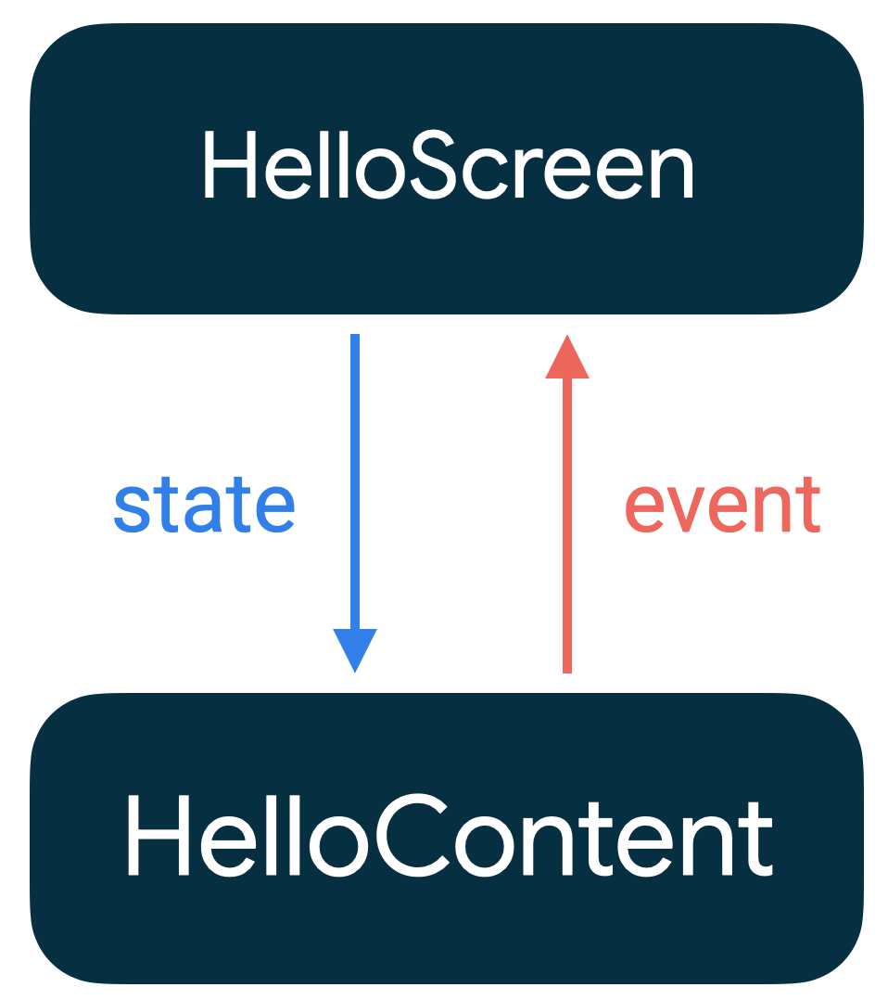
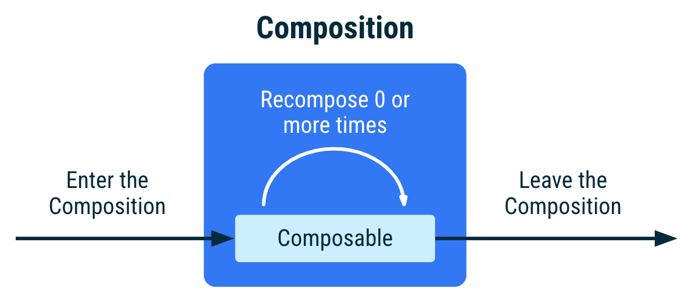

#### 1) What is recomposition?

Recomposition is the process of calling your composable functions again when inputs change. When Compose recomposes
based on new inputs, it only calls the functions or lambdas that might have changed, and skips the rest. By skipping all
functions or lambdas that don't have changed parameters, Compose can recompose efficiently.

***

#### 2) remember, remember(key), rememberSaveable, remember { derivedStateOf() } difference

*remember* - allows you to remember state from previous recompose invocation

*remember(key)* - will be recomposed only when key will change

*rememberSaveable* - similarly to *remember*, but the stored value will survive the activity or process recreation using
the saved instance state mechanism (for example it happens when the screen is rotated in the Android application).

*remember { derivedStateOf(data) }* - similarly to *remember(key)*, but will recompose only if the result inside lambda
changes

***

#### 3) What is SideEffect for?

A side-effect is a change to the state of the app that happens outside the scope of a composable function. Composables
should ideally be side-effect free. Sometimes side-effects are necessary, for example, to trigger a one-off event such
as showing a snackbar or navigate to another screen given a certain state condition. These actions should be called from
a controlled environment that is aware of the lifecycle of the composable.

***

#### 4) Effect types

*LaunchedEffect* - run suspend functions in the scope of a composable. Use to call suspend functions safely from inside
a composable.

*DisposableEffect* - effects that require cleanup. For side effects that need to be cleaned up after the keys change or
if the composable leaves the Composition. Allow register and unregister observers when needed.

*SideEffect* - publish Compose state to non-compose code

***

#### 4) State types

[//]: # TODO(https://developer.android.com/jetpack/compose/side-effects#rememberupdatedstate)

*rememberUpdatedState* - ?

*produceState* -

*derivedStateOf* -

*snapshotFlow* - ?

#### 5) Что такое Snapshot Policy?

#### 7) Переиспользует ли LazyColumn элементы по аналогии с RecyclerView?

_LazyColumn_ не переиспользует своих дочерних элементов, как _RecyclerView_. Он создает новые _Composables_ по мере
того, как вы прокручиваете список, и по-прежнему работает быстро, поскольку создание новых _Composables_ относительно
дешево, по сравнению с созданием экземпляров Android Views.

#### 8) Сохранит ли _by remember {}_ свое значение при повороте экрана?

Функция _remember_ работает только до тех пор, пока компонуемый объект хранится в Composition. При повороте вся activity
перезапускается, поэтому все состояние теряется. Это также происходит при любом изменении конфигурации и при смерти
процесса.

Хотя remember помогает сохранять состояние при рекомпозиции, состояние не сохраняется при изменении конфигурации. Для
этого вы должны использовать rememberSaveable. rememberSaveable автоматически сохраняет любое значение, которое можно
сохранить в файле Bundle. Это сохранит каждое сохранившееся состояние после изменений конфигурации (таких как повороты)
и смерть процесса.

#### 9) Что значит поднятие состояния (state hoisting)?

Поднятие состояния в Compose — это шаблон перемещения состояния вверх по дереву, чтобы избавить составной объект от
хранения состояния.

Пример: извлекаем name и onValueChange и перемещаем их вверх по дереву в HelloScreen (компоуз функция, которая вызывает
HelloContent)

```Kotlin
@Composable
fun HelloScreen() {
    var name by rememberSaveable { mutableStateOf("") }

    HelloContent(name = name, onNameChange = { name = it })
}
```

Подняв состояние из HelloContent, мы делаем функцию более независимой, переиспользуемой и готовой к тестированию.
HelloContent не зависит от того, как хранится его состояние. Разделение означает, что если вы изменяете или заменяете
HelloScreen, вам не нужно менять способ HelloContent реализации.



Паттерн, в котором состояние снижается, а события возрастают, называется однонаправленным потоком данных (_
unidirectional data flow_).

#### 10) Способы сохранения состояния при рекомпозиции

Используйте _rememberSaveable_ для восстановления состояния пользовательского интерфейса после повторного создания
активити или процесса.
_rememberSaveable_ сохраняет состояние при рекомпозиции. Кроме того, _rememberSaveable_ также сохраняет состояние во
время действия и воссоздания процесса.

Все типы данных, которые добавляются в Bundle файл, сохраняются автоматически. Если вы хотите сохранить что-то, что
нельзя добавить в файл Bundle, есть несколько вариантов.

- Parcelize

```Kotlin
  var someObject = rememberSaveable { mutableStateOf(ParcelizableCustomObject()) } 
```

- MapSaver Для определения собственного правила преобразования объекта в набор значений, которые система может сохранить
  в формате Bundle.

```Kotlin
val SomeSaver = run {
    val nameKey = "Name"
    val anotherFieldKey = "AnotherField"
    mapSaver(
        save = { mapOf(nameKey to it.name, anotherFieldKey to it.anotherField) },
        restore = { CustomObject(it[nameKey] as String, it[anotherFieldKey] as String) }
    )
}

var selectedCity = rememberSaveable(stateSaver = SomeSaver) {
    mutableStateOf(CustomObject("Name", "Field"))
}
```

- ListSaver Чтобы избежать необходимости определять ключи для map, вы также можете использовать listSaver и использовать
  индексы в качестве ключей

#### 11) Жизненный цикл composable

[Link](https://developer.android.com/jetpack/compose/lifecycle)



// TODO

#### 12) Можно ли передавать viewModel в дочерние composable функции?

[Link1 - Business logic and its state holder](https://developer.android.com/topic/architecture/ui-layer/stateholders#business-logic)

[Link2 - ViewModels as source of truth](https://developer.android.com/jetpack/compose/state#viewmodels-source-of-truth)

Согласно документации этого делать нельзя.

1) Нарушение паттерна _UDF_ (однонаправленного потока данных), который рекомендован для удобной, гибкой, адаптируемой и
   тестируемой работы с композабл функциями.
2) Нарушение принципа single source of truth (SSOT). Передача ViewModel вниз позволяет нескольким составным объектам
   вызывать функции ViewModel и изменять их состояние, что усложняет отладку ошибок.
3) Жизненный цикл композабл намного меньше чем viewModel. А так как рекомпозиция может вызываться довольно часто, то
   новая композиция создастся, а старая не сможет очиститься из-за ссылки на viewModel. Это может привести к утечкам.
   Тогда должен возникнуть логичный вопрос почему утечка не возникает всегда, а только при передаче в дочерние
   composable. Согласно документации:

_ViewModels have a longer lifetime than the Composition because they survive configuration changes. They can follow the
lifecycle of the host of Compose content–that is, activities or fragments–or the lifecycle of a destination or the
Navigation graph if you're using the Navigation library. Because of their longer lifetime, ViewModels should not hold
long-lived references to state bound to the lifetime of the Composition. If they do, it could cause memory leaks._

ViewModel может следить за жизненным циклом _host of Compose content_, к чему относятся активити, фрагменты или
**_место назначения навигации_**.

#### 13) Как избежать вызова рекомпозиции всех элементов списка при добавлении одного нового элемента?

[Link1 - Add extra information to help smart recompositions](https://developer.android.com/jetpack/compose/lifecycle#add-info-smart-recomposition)

Если не добавить key для каждого элемента списка, при добавлении нового элемента компилятор не будет знать, где какой
элемент, и ему придется сделать полную рекомпозицию списка.

Обертка блока кода в `key(id) {}`, позволит идентифицировать этот экземпляр в композиции. Значение ключа не обязательно
должно быть глобально уникальным, оно должно быть уникальным только среди экземпляров этого блока кода.

#### 14) За что отвечает аннотация @Stable

В случае если composable уже включен в композицию (был вызван, инициализирован, отрисован), он может пропустить
рекомпозицию, если все входные данные стабильны и не изменились.

Что значит стабилен?

- Результат _equals_ для двух экземпляров всегда будет одинаковым для одних и тех же двух экземпляров.
- Если _публичное_ свойство изменится, Composition будет уведомлено.
- Все публичные свойства также стабильны.

Есть несколько типов, которые компилятор Compose считает по дефолту стабильными, даже не смотря на то, что они не
помечены как @Stable:

- Все типы примитивных значений: Boolean, Int, Long, Float, Char
- Strings
- Все типы функций (лямбды)

Compose пропускает рекомпозицию компонуемого, если все входные данные стабильны и не изменились. Сравнение использует _
equals_ метод.

Compose считает тип стабильным только в том случае, если он может это доказать. Например, интерфейс обычно считается
нестабильным, и типы с изменяемыми общедоступными свойствами, реализация которых может быть неизменной, также не
являются стабильными.

Если Compose не может определить, что тип является стабильным, но вы хотите, чтобы Compose считал его стабильным,
пометьте его _@Stable_ аннотацией.

#### 15) Как добавить отступы между элементами списка?
1) Arrangement.spacedBy
```Kotlin
LazyRow(
    horizontalArrangement = Arrangement.spacedBy(8.dp),
    contentPadding = PaddingValues(horizontal = 16.dp),
    modifier = modifier
) {
    items(alignYourBodyData) { item ->
        AlignYourBodyElement(item.drawable, item.text)
    }
}
```
2) Добавить к каждому элементу Space()
3) Modifier.padding()


