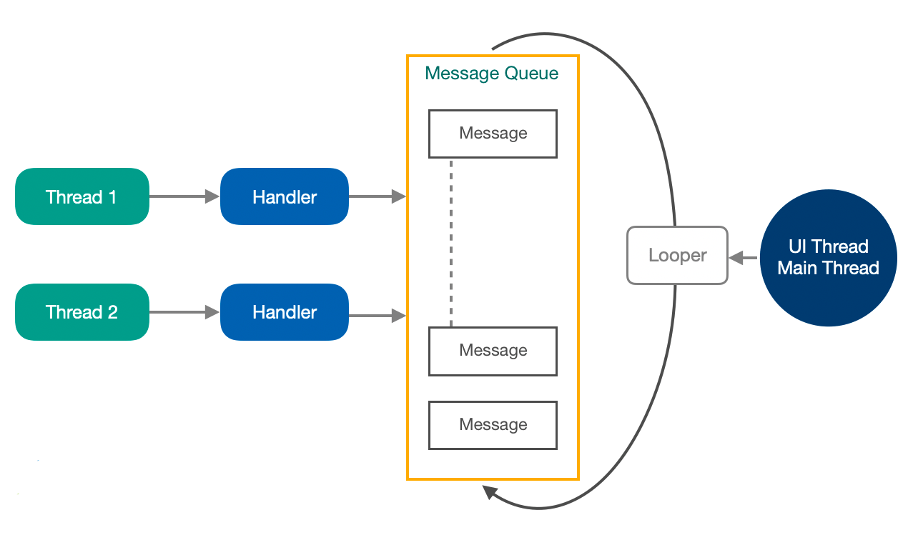

### Multithreading

#### В чем отличие потока от процесса
Процессы и потоки связаны друг с другом, но при этом имеют существенные различия.

Процесс — экземпляр программы во время выполнения, независимый объект, которому выделены системные ресурсы 
(например, процессорное время и память). Каждый процесс выполняется в отдельном адресном пространстве: 
один процесс не может получить доступ к переменным и структурам данных другого. 
Если процесс хочет получить доступ к чужим ресурсам, необходимо использовать межпроцессное взаимодействие. 
Это могут быть конвейеры, файлы, каналы связи между компьютерами и многое другое.

Процесс может иметь дочерний процесс или родительский. У любого процесса должен быть  хотя бы один поток, 
но поток не может существовать без процесса.
У процесса есть жизненный цикл. 

Поток использует то же самое пространства стека, что и процесс, а множество потоков совместно 
используют данные своих состояний. Как правило, каждый поток может работать (читать и писать) 
с одной и той же областью памяти, в отличие от процессов, которые не могут просто так получить доступ 
к памяти другого процесса. У каждого потока есть собственные регистры и собственный стек, 
но другие потоки могут их использовать.

Поток — определенный способ выполнения процесса. Когда один поток изменяет ресурс процесса, 
это изменение сразу же становится видно другим потокам этого процесса.

#### Какую функцию выполняет Handler?
Поскольку есть только один поток, который обновляет пользовательский интерфейс, 
мы используем другие потоки для выполнения нескольких задач в фоновом режиме. Но, чтобы обновить пользовательский 
интерфейс после выполнения, нам нужно отправить результат в основной поток или поток пользовательского интерфейса.

Будет сложно управлять связью со всеми этими потоками, если вы управляете большой группой потоков. 
Таким образом, Android предоставил обработчики, чтобы упростить взаимодействие между процессами.

Компоненты Handler:

- Handler  
- Message
- Message Queue 
- Looper

MessageQueue — это очередь со списком задач, которые будут выполняться в определенном потоке.

Handler - добавялет Message в MessageQueue

Looper - С потоком может быть связан только один Looper. 
Присоединение другого Looper к Thread приводит к RuntimeException. 
Использование статического объекта ThreadLocal в классе Looper гарантирует, что к потоку будет присоединен только один Looper.
Looper отвечает за сохранение поток живым.

